# OneLead Complete - Application Flow & Architecture

**Date**: October 31, 2025
**Version**: 2.0 (with ST ID Discovery & Latest Findings)

---

## 🎯 Executive Summary

OneLead Complete is an intelligent lead generation platform that transforms customer data into actionable intelligence through **5 proven data relationships**. The application categorizes leads into **3 distinct categories** and leverages complete historical context (100% project coverage via ST ID) to provide service recommendations with confidence scoring.

### ✅ **Implementation Status: LIVE**

The intelligent recommendation engine is **fully implemented** in the application (onelead_complete.py) with:
- ✅ ST ID-based historical analysis (100% project coverage)
- ✅ Practice affinity scoring per account
- ✅ Keyword-based service relevance filtering
- ✅ Top 5 intelligent recommendations (not all services dump)
- ✅ Real-time confidence metrics display

**Functions Implemented**:
- `get_account_practice_history(account_id)` - Queries all projects via ST ID, calculates practice distribution
- `get_practice_services(practice_code, df_services, account_id, project_description)` - Intelligent scoring & filtering
- Display shows: "📊 Account History: X total projects | Y in [practice] (Z%)"

---

## 📊 Three-Category Lead System Architecture


---

## 🔄 Complete Data Flow with ST ID Integration


---

## 📦 Category 1: Install Base Assets Flow

### Overview
**Source**: 63 hardware assets from Install Base table
**Trigger**: EOL/EOSL dates, warranty expiration, support status
**Priority**: Risk-based (Critical, High, Medium, Low)

### Data Flow Diagram


---

## 📦 Category 1: Example 1 - 3PAR Storage EOL

### Scenario Details
- **Asset**: HP 3PAR StoreServ 7400 Storage
- **Account**: ST ID 56088
- **Support Status**: Warranty Expired - Uncovered Box
- **EOL Date**: Approaching (< 6 months)
- **Risk Level**: CRITICAL

### Complete Flow


---

## 📦 Category 1: Example 2 - DL360 Server Warranty Expired

### Scenario Details
- **Asset**: HP DL360p Gen8 Server
- **Account**: ST ID 56769
- **Support Status**: Warranty Expired - Uncovered Box
- **Last Service**: Over 2 years ago
- **Risk Level**: HIGH

### Complete Flow


---

## 🚀 Category 2: Ongoing Projects Flow

### Overview
**Source**: 224 active projects (end_date > today)
**Trigger**: Project completion date approaching
**Priority**: Days remaining (< 30 days = Critical, 30-90 = High, 90+ = Medium)

### Data Flow Diagram


---

## 🚀 Category 2: Example 1 - Cloud Migration (30 days to completion)

### Scenario Details
- **Project**: Azure Cloud Migration for Account 56088
- **Practice**: CLD & PLT (Cloud & Platform)
- **Days to Completion**: 31 days remaining
- **Priority**: CRITICAL
- **Business Area**: G400 (Hybrid Cloud Infrastructure)

### Complete Flow


---

## 🚀 Category 2: Example 2 - Network Upgrade (90 days to completion)

### Scenario Details
- **Project**: Campus Network Upgrade for Account 56769
- **Practice**: NTWK & CYB (Network & Cyber)
- **Days to Completion**: 93 days remaining
- **Priority**: HIGH
- **Business Area**: Network Infrastructure

### Complete Flow


---

## ✅ Category 3: Completed Projects Flow

### Overview
**Source**: 312 completed projects (end_date <= today, within 2 years)
**Trigger**: Project completion date
**Priority**: Recency-based (< 90 days = HOT, 90-180 = WARM, 180+ = COLD)

### Data Flow Diagram


---

## ✅ Category 3: Example 1 - Storage Migration (Completed 45 days ago - HOT)

### Scenario Details
- **Project**: 3PAR to Primera Storage Migration
- **Account**: ST ID 56088
- **Practice**: CLD & PLT (Cloud & Platform)
- **Days Since Completion**: 45 days ago
- **Temperature**: HOT

### Complete Flow


---

## ✅ Category 3: Example 2 - VMware Deployment (Completed 150 days ago - WARM)

### Scenario Details
- **Project**: VMware vSphere Cluster Deployment
- **Account**: ST ID 56769
- **Practice**: CLD & PLT (Cloud & Platform)
- **Days Since Completion**: 150 days ago
- **Temperature**: WARM

### Complete Flow


---

## 🔗 The 5 Data Relationships - Detailed Flow

```mermaid
graph TB
    subgraph "Point 1: Install Base → Opportunity"
        IB[Install Base<br/>63 Assets]
        OPP[Opportunities<br/>98 Active]
        IB -->|Account_Sales_Territory_Id<br/>Fuzzy Logic 85%| OPP
        FUZZY[Account Normalization:<br/>Apple Inc = APPLE INC. = Apple Computer Inc<br/>Prevents Duplicates]
        IB -.-> FUZZY
        FUZZY -.-> OPP
    end

    subgraph "Point 2: Product → LS_SKU → Services"
        IB --> MATCH[Keyword Matcher]
        OPP --> MATCH
        MATCH --> SKU[LS_SKU Mappings<br/>152 Service-Product Combinations]
        SKU --> SVCCAT[Services Catalog<br/>286 Services]
        SKU -.->|80.4% Match<br/>230 of 286| SVCCAT
        MATCH1[71 High-Confidence 85%<br/>37 with SKU Codes]
        SKU -.-> MATCH1
    end

    subgraph "Point 3: ST ID Triangle NEW"
        IB --> STID[ST ID Field<br/>Sales Territory ID]
        OPP --> STID
        PRJ[A&PS Projects<br/>2,394 ALL]
        STID -->|100% Coverage<br/>UP FROM 47%| PRJ
        BREAKTHROUGH[+1,276 Projects Gained<br/>Complete Customer 360°]
        STID -.-> BREAKTHROUGH
    end

    subgraph "Point 4: Practice Affinity"
        PRJ --> PRAC1[CLD & PLT<br/>1,710 71.4%]
        PRJ --> PRAC2[NTWK & CYB<br/>384 16.0%]
        PRJ --> PRAC3[AI & D<br/>288 12.0%]
        PRAC1 --> AFFINITY[Practice Affinity<br/>Confidence Scoring]
        PRAC2 --> AFFINITY
        PRAC3 --> AFFINITY
        AFFINITY --> SVCCAT
        PRODLINE[Product Line Rosetta Stone<br/>76.5% Populated]
        AFFINITY -.-> PRODLINE
        PRODLINE -.-> SVCCAT
    end

    subgraph "Point 5: Service Credits"
        PRJ --> CREDITS[Service Credits<br/>1,384 Credit Projects]
        CREDITS --> UTIL[Utilization:<br/>320/650 49%]
        UTIL --> ALERT[Expiry Alerts<br/>Consumption Recommendations]
    end

    subgraph "Final Output"
        SVCCAT --> ENGINE[Recommendation Engine]
        AFFINITY --> ENGINE
        BREAKTHROUGH --> ENGINE
        ALERT --> ENGINE
        ENGINE --> OUTPUT[Intelligent Recommendations<br/>+ SKU Codes<br/>+ Confidence Scores<br/>+ Pricing<br/>+ Historical Context]
    end

    style IB fill:#f093fb
    style OPP fill:#4facfe
    style PRJ fill:#43e97b
    style BREAKTHROUGH fill:#f5576c
    style OUTPUT fill:#01A982
```



---

## 📊 Application UI Flow


---

## 🎯 Key Features Summary

### Data Foundation
- **10 Accounts** with complete historical context
- **63 Install Base Assets** with EOL/support tracking
- **98 Active Opportunities** with product line mapping
- **2,394 Historical Projects** (100% linked via ST ID)
- **152 LS_SKU Service Mappings** with SKU codes
- **286 Services Catalog** entries with practice alignment

### Intelligence Capabilities
1. **Fuzzy Logic Account Normalization** (85% threshold, Levenshtein distance)
2. **ST ID Complete Loop** (100% project coverage, up from 47%)
3. **Product Line Rosetta Stone** (76.5% populated, connects all dimensions)
4. **Practice Affinity Scoring** (71.4% CLD & PLT, 16.0% NTWK & CYB, 12.0% AI & D)
5. **Services Integration** (80.4% match rate, 71 high-confidence with SKUs)

### Confidence Scoring
- **Very High (95%+)**: 70%+ practice affinity, 50+ historical projects
- **High (80-95%)**: 50%+ practice affinity, 20+ historical projects
- **Medium-High (70-80%)**: 30%+ practice affinity, 10+ historical projects
- **Medium (60-70%)**: Limited history but relevant patterns
- **Low (<60%)**: New area or insufficient data

### Temperature Scoring (Category 3)
- **HOT (< 90 days)**: Immediate re-engagement, 85% success rate
- **WARM (90-180 days)**: Active outreach, 70% success rate
- **COLD (180+ days)**: Nurture campaign, 45% success rate

---

## 📚 Related Documentation

- **ST_ID_DISCOVERY_SUMMARY.md** - Breakthrough finding (47% → 100% coverage)
- **PRODUCT_LINE_COMPLETE_MAPPING.md** - Product Line ecosystem (20 unique lines)
- **SERVICES_LSSKU_MAPPING.md** - Services ↔ LS_SKU connections (80.4% match)
- **PROJECT_COLUMNS_MAPPING.md** - Practice/Business Area intelligence
- **FUZZY_LOGIC_USAGE.md** - Account normalization (85% threshold)
- **DATA_RELATIONSHIPS_ANALYSIS.md** - Complete data model (v2.0)

---

## 🔧 Implementation: Intelligent Recommendation Engine

### Code Architecture (onelead_complete.py)

```python
def get_account_practice_history(account_id):
    """
    Get practice affinity for an account using ST ID.

    Returns:
        {
            'total_projects': 1092,
            'practices': {
                'CLD & PLT': {'count': 794, 'percentage': 72.7},
                'NTWK & CYB': {'count': 162, 'percentage': 14.8},
                'AI & D': {'count': 130, 'percentage': 11.9}
            }
        }
    """
    # Query ALL projects for account via ST ID (100% coverage)
    # Calculate practice distribution percentages
    # Return historical context


def get_practice_services(practice_code, df_services, account_id, project_description):
    """
    Intelligent service filtering with keyword scoring.

    Process:
    1. Map practice code → practice names (CLD & PLT → Hybrid Cloud Consulting/Engineering)
    2. Filter services catalog by practice
    3. Score each service based on keyword match:
       - project_description contains "storage" + service contains "storage" = +10 points
       - project_description contains "storage" + service is storage-related = +5 points
    4. Sort by score, return top 5 services

    Returns: Top 5 most relevant services (not all services)
    """

    priority_keywords = {
        'storage': ['Storage', 'BURA', 'Backup'],
        'compute': ['Compute', 'Server', 'HCI'],
        'cloud': ['Cloud', 'Azure', 'Private Cloud'],
        'network': ['Network', 'SD-WAN', 'Wireless'],
        'container': ['Container', 'Kubernetes'],
        'data': ['Data', 'Analytics', 'AI'],
        'platform': ['Platform', 'Linux', 'RedHat']
    }

    # Score and rank services
    # Return top 5 only
```

### Display Logic

```python
def render_completed_project(project, df_skus, df_services):
    """
    Render Category 3 completed project with intelligent recommendations.

    Display includes:
    1. Project information (customer, practice, completion date)
    2. Account history via ST ID:
       "📊 Account History: 1,092 total projects | 794 in CLD & PLT (72.7%)"
    3. Top 5 services filtered by relevance:
       "Top 5 services for CLD & PLT practice, filtered by project relevance"
    """

    # Get account history
    history = get_account_practice_history(project.get('account_id'))

    # Display historical context with confidence
    st.info(f"📊 Account History: {history['total_projects']} total projects | "
           f"{practice_count} in {practice} ({percentage:.1f}%)")

    # Get intelligent service recommendations
    services = get_practice_services(
        practice_code=project['practice'],
        df_services=df_services,
        account_id=project['account_id'],
        project_description=project['title']
    )

    # Display top 5 only (not 10-15 all services)
```

### Before vs After Implementation

#### ❌ **Before (Old Logic)**:
```
Re-engagement Services:
├─ Shows ALL 10-15 services for practice
├─ No filtering or relevance checking
├─ No historical context
├─ Just dumps services catalog
└─ Example: Shows all Hybrid Cloud services regardless of project type
```

#### ✅ **After (New Intelligence)**:
```
Intelligent Service Recommendations:
├─ 📊 Account History: 1,092 total projects | 794 in CLD & PLT (72.7%)
├─ Keyword matching on project description
├─ Scoring algorithm (storage project → storage services)
├─ Top 5 most relevant services only
└─ Example: Storage project → Shows storage-specific services, not all cloud services
```

### Confidence Scoring Formula

```python
def calculate_confidence(account_history, practice_code):
    """
    Confidence levels based on historical data.

    Formula:
    - Very High (95%+): 70%+ practice affinity, 50+ projects
    - High (80-95%): 50%+ practice affinity, 20+ projects
    - Medium-High (70-80%): 30%+ practice affinity, 10+ projects
    - Medium (60-70%): Some history
    - Low (<60%): New area or insufficient data
    """

    total_projects = account_history['total_projects']
    practice_percentage = account_history['practices'][practice_code]['percentage']

    if practice_percentage >= 70 and total_projects >= 50:
        return "VERY HIGH (95%+)"
    elif practice_percentage >= 50 and total_projects >= 20:
        return "HIGH (80-95%)"
    elif practice_percentage >= 30 and total_projects >= 10:
        return "MEDIUM-HIGH (70-80%)"
    # ... etc
```

---

**Generated**: October 31, 2025
**OneLead Complete Version**: 2.0 (with Intelligent Recommendations Implemented)
