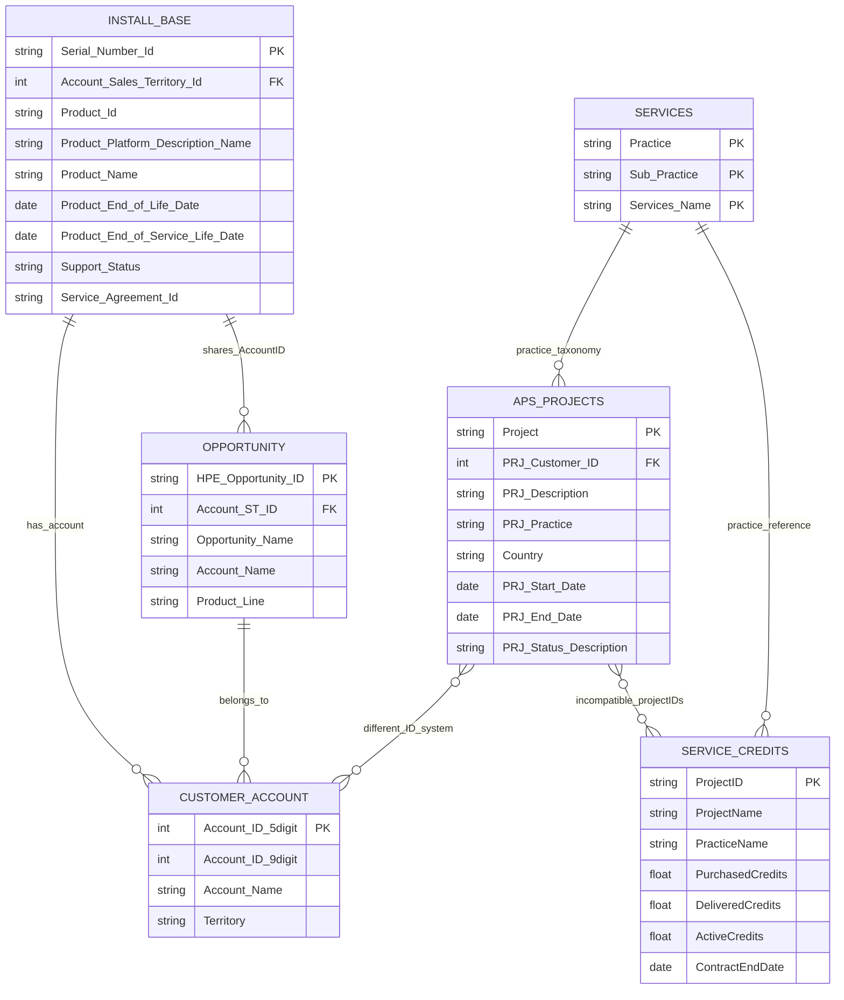

# Entity Relationship Diagram - HPE DataExportAug29th

## Visual ER Diagram

The ER diagram has been generated as:
- **PNG Format**: `er_diagram.png` (for viewing)
- **PDF Format**: `er_diagram.pdf` (for high-quality printing)

## Mermaid ER Diagram



## Entity Descriptions

### 1. INSTALL_BASE
- **Purpose**: Tracks HPE products/equipment installed at customer sites
- **Primary Key**: `Serial_Number_Id`
- **Foreign Key**: `Account_Sales_Territory_Id` (links to Customer Account)
- **Records**: 63
- **Key Relationships**: Direct link to OPPORTUNITY via Account_ST_ID

### 2. OPPORTUNITY
- **Purpose**: Sales opportunities for existing/potential customers
- **Primary Key**: `HPE_Opportunity_ID`
- **Foreign Key**: `Account_ST_ID` (links to Customer Account)
- **Records**: 98
- **Key Relationships**: Shares customer IDs with INSTALL_BASE

### 3. APS_PROJECTS (A&PS Project sample)
- **Purpose**: Advisory & Professional Services projects
- **Primary Key**: `Project`
- **Foreign Key**: `PRJ_Customer_ID` (different numbering system)
- **Records**: 2,394
- **Key Relationships**: Uses 9-digit customer IDs (incompatible with 5-digit system)

### 4. SERVICE_CREDITS
- **Purpose**: Purchased service credits and their utilization
- **Primary Key**: `ProjectID`
- **Records**: 1,384
- **Key Relationships**: Different project ID format from APS_PROJECTS

### 5. SERVICES
- **Purpose**: Service catalog/taxonomy (reference data)
- **Primary Key**: Composite of `Practice`, `Sub_Practice`, `Services`
- **Records**: 286
- **Key Relationships**: Provides taxonomy for other service-related entities

### 6. CUSTOMER_ACCOUNT (Virtual/Implied)
- **Purpose**: Unified customer entity (not explicitly in data)
- **Primary Key**: `Account_ID_5digit`
- **Alternate Key**: `Account_ID_9digit`
- **Note**: This entity is implied but would need to be created for proper integration

## Relationship Types

### Strong Relationships (Direct Foreign Keys)
1. **INSTALL_BASE ↔ OPPORTUNITY**
   - Relationship: One-to-Many
   - Join Key: `Account_Sales_Territory_Id` = `Account_ST_ID`
   - 8 common accounts (80% overlap)

### Weak Relationships (Incompatible Keys)
1. **APS_PROJECTS ↔ Other Entities**
   - Issue: Uses 9-digit customer IDs vs 5-digit in Install/Opportunity
   - Resolution Needed: Customer ID mapping table

2. **SERVICE_CREDITS ↔ APS_PROJECTS**
   - Issue: Different project ID formats (PR-xxx vs JP3-Kxxx)
   - Resolution Needed: Project ID mapping table

### Reference Relationships
1. **SERVICES ↔ All Service Entities**
   - Type: Reference/Lookup
   - Issue: Inconsistent practice naming across entities
   - Resolution Needed: Practice taxonomy standardization

## Data Integration Challenges

### 1. Multiple Customer ID Systems
| System | Format | Example | Used By |
|--------|--------|---------|---------|
| System 1 | 5-digit | 56088 | Install Base, Opportunity |
| System 2 | 9-digit | 110079582 | A&PS Projects |

### 2. Multiple Project ID Formats
| Format | Example | Used By |
|--------|---------|---------|
| JP3-K format | JP3-K1447 | A&PS Projects |
| PR- format | PR-2107153 | Service Credits |

### 3. Inconsistent Practice Taxonomy
| Entity | Practice Names |
|--------|----------------|
| Services | Hybrid Cloud Engineering, Data AI & IOT |
| A&PS Projects | CLD & PLT, NTWK & CYB, AI & D |
| Service Credits | Technical Services, PS - HPE Complete Care |

## Recommended Data Model Improvements

### 1. Create Unified Customer Master
```sql
CREATE TABLE customer_master (
    customer_id INT PRIMARY KEY,
    account_5digit INT,
    account_9digit INT,
    customer_name VARCHAR(255),
    territory VARCHAR(100),
    INDEX idx_5digit (account_5digit),
    INDEX idx_9digit (account_9digit)
);
```

### 2. Create Project Master
```sql
CREATE TABLE project_master (
    project_id INT PRIMARY KEY,
    aps_project_id VARCHAR(50),
    service_credit_project_id VARCHAR(50),
    project_name VARCHAR(255),
    customer_id INT,
    FOREIGN KEY (customer_id) REFERENCES customer_master(customer_id),
    INDEX idx_aps (aps_project_id),
    INDEX idx_sc (service_credit_project_id)
);
```

### 3. Standardize Practice Taxonomy
```sql
CREATE TABLE practice_taxonomy (
    practice_id INT PRIMARY KEY,
    standard_practice VARCHAR(100),
    services_name VARCHAR(100),
    aps_name VARCHAR(100),
    service_credit_name VARCHAR(100)
);
```

## Query Examples for Data Integration

### Find all customer touchpoints
```sql
-- Combining Install Base and Opportunities for a customer
SELECT 
    ib.Account_Sales_Territory_Id as customer_id,
    COUNT(DISTINCT ib.Serial_Number_Id) as installed_products,
    COUNT(DISTINCT o.HPE_Opportunity_ID) as opportunities
FROM INSTALL_BASE ib
LEFT JOIN OPPORTUNITY o ON ib.Account_Sales_Territory_Id = o.Account_ST_ID
GROUP BY ib.Account_Sales_Territory_Id;
```

### Analyze service delivery (if IDs were mapped)
```sql
-- This would work after creating mapping tables
SELECT 
    pm.project_name,
    ap.PRJ_Practice,
    sc.PurchasedCredits,
    sc.DeliveredCredits,
    (sc.DeliveredCredits / sc.PurchasedCredits) * 100 as utilization_pct
FROM project_master pm
JOIN APS_PROJECTS ap ON pm.aps_project_id = ap.Project
JOIN SERVICE_CREDITS sc ON pm.service_credit_project_id = sc.ProjectID;
```

---

*Generated: September 2025*
*Source: DataExportAug29th.xlsx*