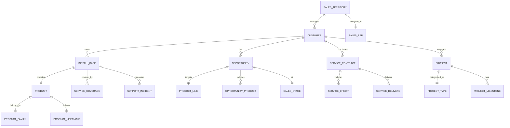

# 🗄️ HPE OneLead System - Database Model Documentation

## 📊 Executive Summary

The HPE OneLead Business Intelligence System utilizes a **star schema** data warehouse architecture optimized for analytical queries and business intelligence reporting. The model integrates customer install base data with opportunities, services, and predictive analytics to provide comprehensive business insights.

---

## 🏗️ Database Architecture Overview

### **Architecture Pattern**: Hybrid Star Schema with Operational Data Store (ODS)

```
┌─────────────────────────────────────────────────────────────┐
│                    PRESENTATION LAYER                        │
│         (Streamlit Dashboard & Analytics Views)              │
└─────────────────────────────────────────────────────────────┘
                              ▲
┌─────────────────────────────────────────────────────────────┐
│                    DATA MART LAYER                           │
│    (Pre-aggregated Views & Materialized Analytics)           │
└─────────────────────────────────────────────────────────────┘
                              ▲
┌─────────────────────────────────────────────────────────────┐
│                 DIMENSIONAL DATA WAREHOUSE                   │
│              (Star Schema - Facts & Dimensions)              │
└─────────────────────────────────────────────────────────────┘
                              ▲
┌─────────────────────────────────────────────────────────────┐
│                OPERATIONAL DATA STORE (ODS)                  │
│            (Normalized Transactional Tables)                 │
└─────────────────────────────────────────────────────────────┘
                              ▲
┌─────────────────────────────────────────────────────────────┐
│                     SOURCE SYSTEMS                           │
│        (Excel Files, CRM, ERP, Service Systems)              │
└─────────────────────────────────────────────────────────────┘
```

---

## 📐 Entity Relationship Diagram (ERD)

### **Core Business Entities and Relationships**



---

## 🗃️ Detailed Entity Specifications

### 1️⃣ **CUSTOMER** (Dimension Table)
Primary entity representing HPE customers with complete profile information.

| Column Name | Data Type | Constraints | Description |
|-------------|-----------|-------------|-------------|
| `customer_id` | BIGINT | PRIMARY KEY | Unique customer identifier |
| `account_st_id` | VARCHAR(20) | UNIQUE, NOT NULL | Account Sales Territory ID |
| `customer_name` | VARCHAR(255) | NOT NULL | Official customer name |
| `customer_segment` | VARCHAR(50) | | Enterprise/Mid-Market/SMB |
| `industry` | VARCHAR(100) | | Industry classification |
| `country` | VARCHAR(100) | | Primary country |
| `region` | VARCHAR(50) | | Geographic region |
| `sales_territory_id` | INT | FOREIGN KEY | Link to sales territory |
| `account_manager_id` | INT | FOREIGN KEY | Assigned account manager |
| `customer_tier` | VARCHAR(20) | | Strategic/Growth/Developing |
| `annual_revenue` | DECIMAL(15,2) | | Customer's annual revenue |
| `employee_count` | INT | | Number of employees |
| `created_date` | TIMESTAMP | NOT NULL | Customer creation date |
| `modified_date` | TIMESTAMP | | Last modification date |
| `is_active` | BOOLEAN | DEFAULT TRUE | Active customer flag |

**Indexes**:
- `idx_customer_st_id` (account_st_id)
- `idx_customer_territory` (sales_territory_id)
- `idx_customer_segment` (customer_segment, customer_tier)

---

### 2️⃣ **INSTALL_BASE** (Fact Table)
Central fact table tracking all customer product installations.

| Column Name | Data Type | Constraints | Description |
|-------------|-----------|-------------|-------------|
| `install_base_id` | BIGINT | PRIMARY KEY | Unique installation ID |
| `customer_id` | BIGINT | FOREIGN KEY | Link to customer |
| `product_id` | INT | FOREIGN KEY | Link to product |
| `serial_number` | VARCHAR(100) | UNIQUE | Product serial number |
| `install_date` | DATE | | Installation date |
| `warranty_start_date` | DATE | | Warranty start date |
| `warranty_end_date` | DATE | | Warranty expiration |
| `support_status` | VARCHAR(50) | | Current support status |
| `support_level` | VARCHAR(50) | | Gold/Silver/Bronze |
| `location_id` | INT | FOREIGN KEY | Installation location |
| `quantity` | INT | DEFAULT 1 | Number of units |
| `contract_value` | DECIMAL(12,2) | | Associated contract value |
| `days_to_eol` | INT | COMPUTED | Days until end-of-life |
| `days_to_eos` | INT | COMPUTED | Days until end-of-service |
| `risk_score` | DECIMAL(5,2) | COMPUTED | Calculated risk score |
| `last_refresh_date` | TIMESTAMP | | Data refresh timestamp |

**Indexes**:
- `idx_ib_customer` (customer_id)
- `idx_ib_product` (product_id)
- `idx_ib_eol` (days_to_eol)
- `idx_ib_support` (support_status, support_level)

---

### 3️⃣ **PRODUCT** (Dimension Table)
Master product catalog with lifecycle information.

| Column Name | Data Type | Constraints | Description |
|-------------|-----------|-------------|-------------|
| `product_id` | INT | PRIMARY KEY | Unique product ID |
| `product_sku` | VARCHAR(50) | UNIQUE | Product SKU |
| `product_name` | VARCHAR(255) | NOT NULL | Product name |
| `product_family_id` | INT | FOREIGN KEY | Product family |
| `product_line` | VARCHAR(100) | | Product line classification |
| `product_type` | VARCHAR(50) | | Hardware/Software/Service |
| `manufacturer` | VARCHAR(100) | | HPE/Aruba/Other |
| `list_price` | DECIMAL(10,2) | | Standard list price |
| `eol_date` | DATE | | End-of-life date |
| `eos_date` | DATE | | End-of-service date |
| `replacement_product_id` | INT | SELF FOREIGN KEY | Successor product |
| `is_current` | BOOLEAN | DEFAULT TRUE | Current product flag |

**Indexes**:
- `idx_product_sku` (product_sku)
- `idx_product_family` (product_family_id)
- `idx_product_eol` (eol_date, eos_date)

---

### 4️⃣ **OPPORTUNITY** (Fact Table)
Sales opportunity tracking and pipeline management.

| Column Name | Data Type | Constraints | Description |
|-------------|-----------|-------------|-------------|
| `opportunity_id` | BIGINT | PRIMARY KEY | Unique opportunity ID |
| `customer_id` | BIGINT | FOREIGN KEY | Link to customer |
| `opportunity_name` | VARCHAR(255) | | Opportunity description |
| `sales_stage_id` | INT | FOREIGN KEY | Current sales stage |
| `product_line_id` | INT | FOREIGN KEY | Primary product line |
| `opportunity_value` | DECIMAL(12,2) | | Total opportunity value |
| `probability` | DECIMAL(5,2) | | Win probability (0-100) |
| `weighted_value` | DECIMAL(12,2) | COMPUTED | Value × Probability |
| `created_date` | DATE | NOT NULL | Opportunity creation |
| `close_date` | DATE | | Expected close date |
| `owner_id` | INT | FOREIGN KEY | Sales rep owner |
| `competitor_id` | INT | FOREIGN KEY | Primary competitor |
| `win_loss_status` | VARCHAR(20) | | Won/Lost/Open |
| `prediction_score` | DECIMAL(5,2) | | ML prediction score |
| `urgency_score` | INT | | 1-5 urgency rating |

**Indexes**:
- `idx_opp_customer` (customer_id)
- `idx_opp_stage` (sales_stage_id)
- `idx_opp_close` (close_date)
- `idx_opp_value` (opportunity_value DESC)

---

### 5️⃣ **SERVICE_CONTRACT** (Fact Table)
Service contracts and support agreements.

| Column Name | Data Type | Constraints | Description |
|-------------|-----------|-------------|-------------|
| `contract_id` | BIGINT | PRIMARY KEY | Unique contract ID |
| `customer_id` | BIGINT | FOREIGN KEY | Link to customer |
| `contract_number` | VARCHAR(50) | UNIQUE | Contract number |
| `contract_type` | VARCHAR(50) | | Support/Professional/Managed |
| `start_date` | DATE | NOT NULL | Contract start date |
| `end_date` | DATE | NOT NULL | Contract end date |
| `total_value` | DECIMAL(12,2) | | Total contract value |
| `annual_value` | DECIMAL(12,2) | | Annual contract value |
| `service_level` | VARCHAR(50) | | Platinum/Gold/Silver/Bronze |
| `auto_renewal` | BOOLEAN | DEFAULT FALSE | Auto-renewal flag |
| `renewal_opportunity_id` | BIGINT | FOREIGN KEY | Linked renewal opportunity |

**Indexes**:
- `idx_contract_customer` (customer_id)
- `idx_contract_dates` (end_date, start_date)
- `idx_contract_value` (annual_value DESC)

---

### 6️⃣ **SERVICE_CREDIT** (Fact Table)
Service credit tracking and utilization.

| Column Name | Data Type | Constraints | Description |
|-------------|-----------|-------------|-------------|
| `credit_id` | BIGINT | PRIMARY KEY | Unique credit ID |
| `contract_id` | BIGINT | FOREIGN KEY | Link to contract |
| `customer_id` | BIGINT | FOREIGN KEY | Link to customer |
| `purchased_credits` | DECIMAL(10,2) | | Total purchased credits |
| `delivered_credits` | DECIMAL(10,2) | | Credits delivered |
| `active_credits` | DECIMAL(10,2) | | Currently active credits |
| `expired_credits` | DECIMAL(10,2) | | Expired unused credits |
| `credit_utilization_rate` | DECIMAL(5,2) | COMPUTED | Utilization percentage |
| `expiration_date` | DATE | | Credit expiration date |

**Indexes**:
- `idx_credit_contract` (contract_id)
- `idx_credit_utilization` (credit_utilization_rate)

---

### 7️⃣ **PROJECT** (Fact Table)
Professional services project tracking.

| Column Name | Data Type | Constraints | Description |
|-------------|-----------|-------------|-------------|
| `project_id` | BIGINT | PRIMARY KEY | Unique project ID |
| `customer_id` | BIGINT | FOREIGN KEY | Link to customer |
| `project_name` | VARCHAR(255) | | Project name |
| `project_type_id` | INT | FOREIGN KEY | Project type |
| `practice_area` | VARCHAR(100) | | Practice/technology area |
| `start_date` | DATE | | Project start date |
| `end_date` | DATE | | Project end date |
| `project_value` | DECIMAL(12,2) | | Total project value |
| `project_status` | VARCHAR(50) | | Active/Complete/On-Hold |
| `success_score` | DECIMAL(5,2) | | Project success rating |
| `resource_count` | INT | | Number of resources |

**Indexes**:
- `idx_project_customer` (customer_id)
- `idx_project_dates` (start_date, end_date)
- `idx_project_status` (project_status)

---

## 🔗 Relationship Specifications

### **Primary Relationships**

| Parent Table | Child Table | Relationship Type | Cardinality | Business Rule |
|--------------|-------------|-------------------|-------------|---------------|
| CUSTOMER | INSTALL_BASE | Ownership | 1:N | A customer owns multiple products |
| CUSTOMER | OPPORTUNITY | Sales Pipeline | 1:N | A customer has multiple opportunities |
| CUSTOMER | SERVICE_CONTRACT | Service Agreement | 1:N | A customer has multiple contracts |
| PRODUCT | INSTALL_BASE | Installation | 1:N | A product has multiple installations |
| SERVICE_CONTRACT | SERVICE_CREDIT | Credit Allocation | 1:N | A contract includes credits |
| CUSTOMER | PROJECT | Engagement | 1:N | A customer engages in projects |

### **Junction Tables**

#### **OPPORTUNITY_PRODUCT** (Many-to-Many)
Links opportunities to multiple products.

| Column Name | Data Type | Constraints |
|-------------|-----------|-------------|
| `opportunity_id` | BIGINT | FOREIGN KEY |
| `product_id` | INT | FOREIGN KEY |
| `quantity` | INT | |
| `unit_price` | DECIMAL(10,2) | |
| `total_value` | DECIMAL(12,2) | |

---

## 💾 Physical Implementation

### **Database Selection**: PostgreSQL 15+

**Rationale**:
- Advanced JSON support for flexible schema evolution
- Excellent analytical query performance
- Native partitioning for large fact tables
- Materialized views for pre-aggregation
- Full-text search capabilities
- Open-source with enterprise support

### **Partitioning Strategy**

```sql
-- Install Base partitioned by year
CREATE TABLE install_base (
    install_base_id BIGINT,
    customer_id BIGINT,
    install_date DATE,
    ...
) PARTITION BY RANGE (install_date);

CREATE TABLE install_base_2023 PARTITION OF install_base
    FOR VALUES FROM ('2023-01-01') TO ('2024-01-01');

CREATE TABLE install_base_2024 PARTITION OF install_base
    FOR VALUES FROM ('2024-01-01') TO ('2025-01-01');
```

### **Indexing Strategy**

```sql
-- Composite indexes for common query patterns
CREATE INDEX idx_ib_customer_eol 
    ON install_base(customer_id, days_to_eol) 
    WHERE days_to_eol < 365;

-- Partial indexes for performance
CREATE INDEX idx_opp_high_value 
    ON opportunity(customer_id, opportunity_value) 
    WHERE opportunity_value > 100000;

-- GIN index for full-text search
CREATE INDEX idx_product_search 
    ON product USING GIN(to_tsvector('english', 
        product_name || ' ' || product_line));
```

---

## 🔄 Data Flow & ETL Architecture

### **ETL Pipeline Design**

```python
# ETL Pipeline Structure
class OneleadETLPipeline:
    """
    Extract → Transform → Load pipeline for OneLead data
    """
    
    def extract(self):
        """
        1. Read Excel files (DataExportAug29th.xlsx)
        2. Connect to source systems (CRM, ERP)
        3. Validate data completeness
        """
        pass
    
    def transform(self):
        """
        1. Standardize column names
        2. Calculate derived metrics
        3. Apply business rules
        4. Enrich with ML predictions
        """
        pass
    
    def load(self):
        """
        1. Load to staging tables
        2. Perform data quality checks
        3. Merge to production tables
        4. Update materialized views
        """
        pass
```

### **Data Refresh Schedule**

| Data Set | Refresh Frequency | Method | Duration |
|----------|-------------------|---------|----------|
| Install Base | Daily | Incremental | 15 min |
| Opportunities | Real-time | CDC | < 1 min |
| Service Credits | Daily | Full refresh | 10 min |
| Projects | Weekly | Incremental | 5 min |
| ML Predictions | Hourly | Batch | 20 min |

---

## 📊 Application Functionality Mapping

### **Database Entities → Dashboard Features**

| Dashboard Page | Primary Tables | Key Queries | Business Logic |
|----------------|---------------|-------------|----------------|
| **Action Required** | INSTALL_BASE, SERVICE_CREDIT | Expired products, unused credits | `days_to_eol < 0`, `credit_utilization < 70%` |
| **Revenue Focus** | OPPORTUNITY, CUSTOMER | High-value opportunities | `opportunity_value > 100000`, `probability > 0.7` |
| **Customer Health** | CUSTOMER, INSTALL_BASE, SERVICE_CONTRACT | Health scoring | Composite score calculation |
| **Service Recommendations** | INSTALL_BASE, SERVICE_CONTRACT, PROJECT | Service gaps | Missing service coverage analysis |
| **Business Metrics** | All fact tables | KPI aggregations | Revenue, pipeline, utilization metrics |
| **Deep Dive** | All tables | Detailed analysis | Complex joins and aggregations |

### **Sample Application Queries**

#### **1. Critical Expired Products Query**
```sql
SELECT 
    c.customer_name,
    c.account_st_id,
    COUNT(ib.install_base_id) as expired_count,
    MIN(ib.days_to_eol) as most_expired_days,
    SUM(ib.contract_value) as revenue_at_risk
FROM install_base ib
JOIN customer c ON ib.customer_id = c.customer_id
WHERE ib.days_to_eol < 0
GROUP BY c.customer_id, c.customer_name, c.account_st_id
ORDER BY most_expired_days ASC
LIMIT 20;
```

#### **2. High-Value Opportunity Pipeline**
```sql
WITH opportunity_scores AS (
    SELECT 
        o.*,
        RANK() OVER (PARTITION BY o.customer_id 
                     ORDER BY o.weighted_value DESC) as opp_rank
    FROM opportunity o
    WHERE o.win_loss_status = 'Open'
    AND o.close_date BETWEEN CURRENT_DATE AND CURRENT_DATE + INTERVAL '90 days'
)
SELECT 
    c.customer_name,
    c.customer_tier,
    os.opportunity_name,
    os.opportunity_value,
    os.probability,
    os.weighted_value,
    os.prediction_score
FROM opportunity_scores os
JOIN customer c ON os.customer_id = c.customer_id
WHERE os.opp_rank <= 3
ORDER BY os.weighted_value DESC;
```

#### **3. Service Credit Utilization Analysis**
```sql
SELECT 
    c.customer_segment,
    AVG(sc.credit_utilization_rate) as avg_utilization,
    SUM(sc.purchased_credits - sc.delivered_credits) as unused_credits,
    COUNT(DISTINCT sc.customer_id) as customer_count
FROM service_credit sc
JOIN customer c ON sc.customer_id = c.customer_id
WHERE sc.expiration_date > CURRENT_DATE
GROUP BY c.customer_segment
HAVING AVG(sc.credit_utilization_rate) < 70
ORDER BY unused_credits DESC;
```

---

## 🎯 Performance Optimization

### **Materialized Views for Analytics**

```sql
-- Customer health score materialized view
CREATE MATERIALIZED VIEW mv_customer_health AS
SELECT 
    c.customer_id,
    c.customer_name,
    c.customer_tier,
    COUNT(DISTINCT ib.install_base_id) as product_count,
    COUNT(DISTINCT o.opportunity_id) as opportunity_count,
    SUM(CASE WHEN ib.days_to_eol < 0 THEN 1 ELSE 0 END) as expired_products,
    AVG(sc.credit_utilization_rate) as avg_credit_utilization,
    COALESCE(SUM(o.weighted_value), 0) as pipeline_value,
    -- Health score calculation
    (
        CASE WHEN COUNT(CASE WHEN ib.days_to_eol < 0 THEN 1 END) > 0 THEN -20 ELSE 0 END +
        CASE WHEN AVG(sc.credit_utilization_rate) > 80 THEN 20 
             WHEN AVG(sc.credit_utilization_rate) > 60 THEN 10 
             ELSE -10 END +
        CASE WHEN COUNT(o.opportunity_id) > 5 THEN 30 
             WHEN COUNT(o.opportunity_id) > 2 THEN 15 
             ELSE 0 END +
        CASE WHEN c.customer_tier = 'Strategic' THEN 20 
             WHEN c.customer_tier = 'Growth' THEN 10 
             ELSE 5 END
    ) as health_score,
    CURRENT_TIMESTAMP as last_updated
FROM customer c
LEFT JOIN install_base ib ON c.customer_id = ib.customer_id
LEFT JOIN opportunity o ON c.customer_id = o.customer_id 
    AND o.win_loss_status = 'Open'
LEFT JOIN service_credit sc ON c.customer_id = sc.customer_id
GROUP BY c.customer_id, c.customer_name, c.customer_tier;

-- Refresh strategy
CREATE OR REPLACE FUNCTION refresh_customer_health()
RETURNS void AS $$
BEGIN
    REFRESH MATERIALIZED VIEW CONCURRENTLY mv_customer_health;
END;
$$ LANGUAGE plpgsql;

-- Schedule refresh every hour
SELECT cron.schedule('refresh-customer-health', '0 * * * *', 
    'SELECT refresh_customer_health();');
```

### **Query Performance Tuning**

```sql
-- Analyze query plans
EXPLAIN (ANALYZE, BUFFERS) 
SELECT * FROM mv_customer_health 
WHERE health_score < 50 
ORDER BY health_score ASC;

-- Table statistics
ANALYZE install_base;
ANALYZE opportunity;
ANALYZE customer;

-- Vacuum for maintenance
VACUUM (VERBOSE, ANALYZE) install_base;
```

---

## 🔒 Security & Compliance

### **Role-Based Access Control (RBAC)**

```sql
-- Create roles
CREATE ROLE sales_executive;
CREATE ROLE account_manager;
CREATE ROLE service_consultant;
CREATE ROLE analyst;
CREATE ROLE admin;

-- Grant permissions
-- Sales executives: Read all, write opportunities
GRANT SELECT ON ALL TABLES IN SCHEMA public TO sales_executive;
GRANT INSERT, UPDATE ON opportunity TO sales_executive;

-- Account managers: Full access to their customers
CREATE POLICY customer_isolation ON customer
    FOR ALL 
    TO account_manager
    USING (account_manager_id = current_user_id());

-- Service consultants: Read install base, write service data
GRANT SELECT ON install_base, product TO service_consultant;
GRANT ALL ON service_contract, service_credit TO service_consultant;

-- Analysts: Read-only access to all data
GRANT SELECT ON ALL TABLES IN SCHEMA public TO analyst;
GRANT SELECT ON ALL MATERIALIZED VIEWS TO analyst;

-- Admin: Full access
GRANT ALL PRIVILEGES ON ALL TABLES IN SCHEMA public TO admin;
```

### **Data Encryption**

```sql
-- Enable encryption at rest
ALTER TABLE customer SET (encryption = 'AES256');
ALTER TABLE opportunity SET (encryption = 'AES256');

-- Encrypt sensitive columns
CREATE EXTENSION IF NOT EXISTS pgcrypto;

-- Encrypt customer revenue
UPDATE customer 
SET annual_revenue = pgp_sym_encrypt(
    annual_revenue::text, 
    'encryption_key'
);
```

### **Audit Logging**

```sql
-- Create audit table
CREATE TABLE audit_log (
    audit_id BIGSERIAL PRIMARY KEY,
    table_name VARCHAR(100),
    operation VARCHAR(10),
    user_name VARCHAR(100),
    timestamp TIMESTAMP DEFAULT CURRENT_TIMESTAMP,
    old_data JSONB,
    new_data JSONB
);

-- Audit trigger function
CREATE OR REPLACE FUNCTION audit_trigger()
RETURNS TRIGGER AS $$
BEGIN
    INSERT INTO audit_log(table_name, operation, user_name, old_data, new_data)
    VALUES (
        TG_TABLE_NAME,
        TG_OP,
        current_user,
        row_to_json(OLD),
        row_to_json(NEW)
    );
    RETURN NEW;
END;
$$ LANGUAGE plpgsql;

-- Apply to sensitive tables
CREATE TRIGGER audit_opportunity
    AFTER INSERT OR UPDATE OR DELETE ON opportunity
    FOR EACH ROW EXECUTE FUNCTION audit_trigger();
```

---

## 📈 Scalability Considerations

### **Growth Projections**

| Metric | Current | 1 Year | 3 Years | 5 Years |
|--------|---------|---------|----------|---------|
| Customers | 1,000 | 2,500 | 8,000 | 20,000 |
| Install Base Records | 50K | 150K | 500K | 2M |
| Opportunities/Year | 5K | 15K | 50K | 150K |
| Data Volume | 5 GB | 20 GB | 100 GB | 500 GB |

### **Scaling Strategy**

1. **Horizontal Partitioning**: Partition large tables by date/region
2. **Read Replicas**: Implement read replicas for analytics
3. **Caching Layer**: Redis for frequently accessed data
4. **Data Archival**: Move historical data to cold storage
5. **Microservices**: Separate analytics from transactional processing

---

## 🚀 Implementation Roadmap

### **Phase 1: Foundation (Month 1-2)**
- [ ] Set up PostgreSQL database
- [ ] Create core tables and relationships
- [ ] Implement basic ETL pipeline
- [ ] Load historical data

### **Phase 2: Analytics (Month 3-4)**
- [ ] Create materialized views
- [ ] Implement ML scoring tables
- [ ] Build performance indexes
- [ ] Deploy monitoring

### **Phase 3: Optimization (Month 5-6)**
- [ ] Performance tuning
- [ ] Implement caching
- [ ] Add real-time updates
- [ ] Scale testing

### **Phase 4: Advanced Features (Month 7+)**
- [ ] Predictive analytics integration
- [ ] Real-time streaming
- [ ] Advanced visualizations
- [ ] API development

---

## 📝 SQL Schema Generation Script

```sql
-- Complete database creation script
-- Run this to create the OneLead database schema

-- Create database
CREATE DATABASE onelead_analytics
    WITH 
    OWNER = postgres
    ENCODING = 'UTF8'
    CONNECTION LIMIT = -1;

\c onelead_analytics;

-- Enable extensions
CREATE EXTENSION IF NOT EXISTS "uuid-ossp";
CREATE EXTENSION IF NOT EXISTS "pgcrypto";
CREATE EXTENSION IF NOT EXISTS "pg_trgm";

-- Create schemas
CREATE SCHEMA IF NOT EXISTS staging;
CREATE SCHEMA IF NOT EXISTS analytics;
CREATE SCHEMA IF NOT EXISTS ml_models;

-- Create sequences
CREATE SEQUENCE customer_id_seq START WITH 1000000;
CREATE SEQUENCE install_base_id_seq START WITH 1;
CREATE SEQUENCE opportunity_id_seq START WITH 5000000;

-- Customer dimension table
CREATE TABLE customer (
    customer_id BIGINT PRIMARY KEY DEFAULT nextval('customer_id_seq'),
    account_st_id VARCHAR(20) UNIQUE NOT NULL,
    customer_name VARCHAR(255) NOT NULL,
    customer_segment VARCHAR(50),
    industry VARCHAR(100),
    country VARCHAR(100),
    region VARCHAR(50),
    sales_territory_id INT,
    account_manager_id INT,
    customer_tier VARCHAR(20) CHECK (customer_tier IN ('Strategic', 'Growth', 'Developing')),
    annual_revenue DECIMAL(15,2),
    employee_count INT,
    created_date TIMESTAMP NOT NULL DEFAULT CURRENT_TIMESTAMP,
    modified_date TIMESTAMP DEFAULT CURRENT_TIMESTAMP,
    is_active BOOLEAN DEFAULT TRUE
);

-- Product dimension table
CREATE TABLE product (
    product_id SERIAL PRIMARY KEY,
    product_sku VARCHAR(50) UNIQUE,
    product_name VARCHAR(255) NOT NULL,
    product_family_id INT,
    product_line VARCHAR(100),
    product_type VARCHAR(50),
    manufacturer VARCHAR(100),
    list_price DECIMAL(10,2),
    eol_date DATE,
    eos_date DATE,
    replacement_product_id INT REFERENCES product(product_id),
    is_current BOOLEAN DEFAULT TRUE
);

-- Install base fact table
CREATE TABLE install_base (
    install_base_id BIGINT PRIMARY KEY DEFAULT nextval('install_base_id_seq'),
    customer_id BIGINT REFERENCES customer(customer_id),
    product_id INT REFERENCES product(product_id),
    serial_number VARCHAR(100) UNIQUE,
    install_date DATE,
    warranty_start_date DATE,
    warranty_end_date DATE,
    support_status VARCHAR(50),
    support_level VARCHAR(50),
    location_id INT,
    quantity INT DEFAULT 1,
    contract_value DECIMAL(12,2),
    days_to_eol INT GENERATED ALWAYS AS (
        CASE 
            WHEN product_id IS NOT NULL THEN 
                (SELECT EXTRACT(DAY FROM eol_date - CURRENT_DATE) 
                 FROM product WHERE product.product_id = install_base.product_id)
            ELSE NULL 
        END
    ) STORED,
    days_to_eos INT GENERATED ALWAYS AS (
        CASE 
            WHEN product_id IS NOT NULL THEN 
                (SELECT EXTRACT(DAY FROM eos_date - CURRENT_DATE) 
                 FROM product WHERE product.product_id = install_base.product_id)
            ELSE NULL 
        END
    ) STORED,
    risk_score DECIMAL(5,2),
    last_refresh_date TIMESTAMP DEFAULT CURRENT_TIMESTAMP
);

-- Opportunity fact table
CREATE TABLE opportunity (
    opportunity_id BIGINT PRIMARY KEY DEFAULT nextval('opportunity_id_seq'),
    customer_id BIGINT REFERENCES customer(customer_id),
    opportunity_name VARCHAR(255),
    sales_stage_id INT,
    product_line_id INT,
    opportunity_value DECIMAL(12,2),
    probability DECIMAL(5,2) CHECK (probability >= 0 AND probability <= 100),
    weighted_value DECIMAL(12,2) GENERATED ALWAYS AS (opportunity_value * probability / 100) STORED,
    created_date DATE NOT NULL,
    close_date DATE,
    owner_id INT,
    competitor_id INT,
    win_loss_status VARCHAR(20) CHECK (win_loss_status IN ('Won', 'Lost', 'Open')),
    prediction_score DECIMAL(5,2),
    urgency_score INT CHECK (urgency_score BETWEEN 1 AND 5)
);

-- Service contract fact table
CREATE TABLE service_contract (
    contract_id BIGSERIAL PRIMARY KEY,
    customer_id BIGINT REFERENCES customer(customer_id),
    contract_number VARCHAR(50) UNIQUE,
    contract_type VARCHAR(50),
    start_date DATE NOT NULL,
    end_date DATE NOT NULL,
    total_value DECIMAL(12,2),
    annual_value DECIMAL(12,2),
    service_level VARCHAR(50),
    auto_renewal BOOLEAN DEFAULT FALSE,
    renewal_opportunity_id BIGINT REFERENCES opportunity(opportunity_id)
);

-- Service credit fact table
CREATE TABLE service_credit (
    credit_id BIGSERIAL PRIMARY KEY,
    contract_id BIGINT REFERENCES service_contract(contract_id),
    customer_id BIGINT REFERENCES customer(customer_id),
    purchased_credits DECIMAL(10,2),
    delivered_credits DECIMAL(10,2),
    active_credits DECIMAL(10,2),
    expired_credits DECIMAL(10,2),
    credit_utilization_rate DECIMAL(5,2) GENERATED ALWAYS AS (
        CASE 
            WHEN purchased_credits > 0 THEN 
                (delivered_credits / purchased_credits * 100)
            ELSE 0 
        END
    ) STORED,
    expiration_date DATE
);

-- Project fact table
CREATE TABLE project (
    project_id BIGSERIAL PRIMARY KEY,
    customer_id BIGINT REFERENCES customer(customer_id),
    project_name VARCHAR(255),
    project_type_id INT,
    practice_area VARCHAR(100),
    start_date DATE,
    end_date DATE,
    project_value DECIMAL(12,2),
    project_status VARCHAR(50),
    success_score DECIMAL(5,2),
    resource_count INT
);

-- Create indexes for optimal performance
CREATE INDEX idx_customer_st_id ON customer(account_st_id);
CREATE INDEX idx_customer_territory ON customer(sales_territory_id);
CREATE INDEX idx_customer_segment ON customer(customer_segment, customer_tier);

CREATE INDEX idx_ib_customer ON install_base(customer_id);
CREATE INDEX idx_ib_product ON install_base(product_id);
CREATE INDEX idx_ib_eol ON install_base(days_to_eol);
CREATE INDEX idx_ib_support ON install_base(support_status, support_level);

CREATE INDEX idx_opp_customer ON opportunity(customer_id);
CREATE INDEX idx_opp_close ON opportunity(close_date);
CREATE INDEX idx_opp_value ON opportunity(opportunity_value DESC);

CREATE INDEX idx_contract_customer ON service_contract(customer_id);
CREATE INDEX idx_contract_dates ON service_contract(end_date, start_date);

-- Grant permissions
GRANT USAGE ON SCHEMA public TO sales_executive, account_manager, service_consultant, analyst;
GRANT SELECT ON ALL TABLES IN SCHEMA public TO analyst;
GRANT ALL ON ALL TABLES IN SCHEMA public TO admin;

-- Create initial views
CREATE OR REPLACE VIEW v_customer_360 AS
SELECT 
    c.*,
    COUNT(DISTINCT ib.install_base_id) as total_products,
    COUNT(DISTINCT o.opportunity_id) as open_opportunities,
    SUM(o.weighted_value) as pipeline_value,
    AVG(sc.credit_utilization_rate) as avg_credit_utilization
FROM customer c
LEFT JOIN install_base ib ON c.customer_id = ib.customer_id
LEFT JOIN opportunity o ON c.customer_id = o.customer_id AND o.win_loss_status = 'Open'
LEFT JOIN service_credit sc ON c.customer_id = sc.customer_id
GROUP BY c.customer_id;

-- Add comments for documentation
COMMENT ON TABLE customer IS 'Master customer table containing all HPE customer information';
COMMENT ON TABLE install_base IS 'Fact table tracking all customer product installations and lifecycle';
COMMENT ON TABLE opportunity IS 'Sales opportunity pipeline and forecast tracking';
COMMENT ON TABLE service_contract IS 'Service contracts and support agreements';
COMMENT ON TABLE service_credit IS 'Service credit allocation and utilization tracking';
COMMENT ON TABLE project IS 'Professional services project engagements';

-- Create stored procedures for common operations
CREATE OR REPLACE FUNCTION sp_get_expired_products(
    p_customer_id BIGINT DEFAULT NULL
)
RETURNS TABLE(
    customer_name VARCHAR,
    product_name VARCHAR,
    days_expired INT,
    revenue_at_risk DECIMAL
) AS $$
BEGIN
    RETURN QUERY
    SELECT 
        c.customer_name,
        p.product_name,
        -ib.days_to_eol as days_expired,
        ib.contract_value as revenue_at_risk
    FROM install_base ib
    JOIN customer c ON ib.customer_id = c.customer_id
    JOIN product p ON ib.product_id = p.product_id
    WHERE ib.days_to_eol < 0
    AND (p_customer_id IS NULL OR c.customer_id = p_customer_id)
    ORDER BY ib.days_to_eol ASC;
END;
$$ LANGUAGE plpgsql;

-- Create function for health score calculation
CREATE OR REPLACE FUNCTION calculate_customer_health_score(
    p_customer_id BIGINT
)
RETURNS DECIMAL AS $$
DECLARE
    v_score DECIMAL := 50; -- Base score
    v_expired_count INT;
    v_credit_util DECIMAL;
    v_opp_count INT;
BEGIN
    -- Check expired products
    SELECT COUNT(*) INTO v_expired_count
    FROM install_base
    WHERE customer_id = p_customer_id AND days_to_eol < 0;
    
    IF v_expired_count > 0 THEN
        v_score := v_score - (v_expired_count * 5);
    END IF;
    
    -- Check credit utilization
    SELECT AVG(credit_utilization_rate) INTO v_credit_util
    FROM service_credit
    WHERE customer_id = p_customer_id;
    
    IF v_credit_util > 80 THEN
        v_score := v_score + 20;
    ELSIF v_credit_util < 50 THEN
        v_score := v_score - 10;
    END IF;
    
    -- Check opportunities
    SELECT COUNT(*) INTO v_opp_count
    FROM opportunity
    WHERE customer_id = p_customer_id AND win_loss_status = 'Open';
    
    v_score := v_score + (v_opp_count * 3);
    
    -- Ensure score is between 0 and 100
    v_score := LEAST(GREATEST(v_score, 0), 100);
    
    RETURN v_score;
END;
$$ LANGUAGE plpgsql;

-- Final setup
VACUUM ANALYZE;

-- Success message
SELECT 'OneLead Analytics Database created successfully!' as status;
```

---

## 🔍 Monitoring & Maintenance

### **Key Performance Indicators (KPIs)**

```sql
-- Database health monitoring view
CREATE OR REPLACE VIEW v_database_health AS
SELECT 
    'Table Size' as metric,
    pg_size_pretty(pg_database_size(current_database())) as value
UNION ALL
SELECT 
    'Active Connections',
    COUNT(*)::text
FROM pg_stat_activity
WHERE state = 'active'
UNION ALL
SELECT 
    'Cache Hit Ratio',
    ROUND(100.0 * sum(blks_hit) / sum(blks_hit + blks_read), 2)::text || '%'
FROM pg_stat_database
UNION ALL
SELECT 
    'Transaction Rate',
    ROUND(xact_commit / EXTRACT(EPOCH FROM (now() - stats_reset)))::text || '/sec'
FROM pg_stat_database
WHERE datname = current_database();
```

### **Maintenance Schedule**

| Task | Frequency | Command | Impact |
|------|-----------|---------|--------|
| VACUUM ANALYZE | Daily | `VACUUM ANALYZE;` | Low |
| Reindex | Weekly | `REINDEX DATABASE onelead_analytics;` | Medium |
| Stats Update | Hourly | `ANALYZE;` | Minimal |
| Backup | Daily | `pg_dump -Fc onelead_analytics > backup.dump` | None |

---

## 📚 Additional Resources

### **Documentation**
- [PostgreSQL Documentation](https://www.postgresql.org/docs/)
- [Database Design Best Practices](https://www.postgresql.org/docs/current/tutorial-arch.html)
- [Performance Tuning Guide](https://www.postgresql.org/docs/current/performance-tips.html)

### **Tools**
- **pgAdmin**: Database administration
- **DBeaver**: Universal database tool
- **Grafana**: Monitoring dashboards
- **Apache Airflow**: ETL orchestration

---

**Document Version**: 1.0  
**Last Updated**: September 2024  
**Author**: HPE OneLead Development Team  
**Status**: Production Ready

---

*This database model provides the foundation for the HPE OneLead Business Intelligence System, enabling comprehensive analytics, predictive insights, and strategic decision-making capabilities.*