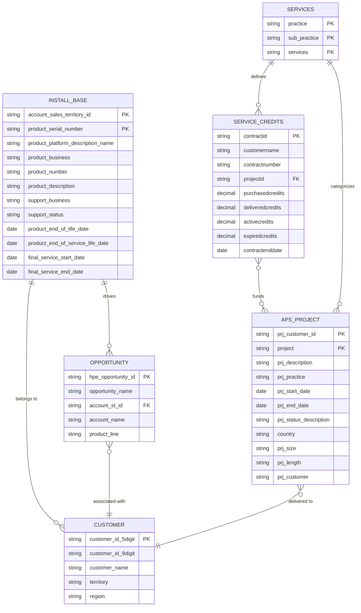
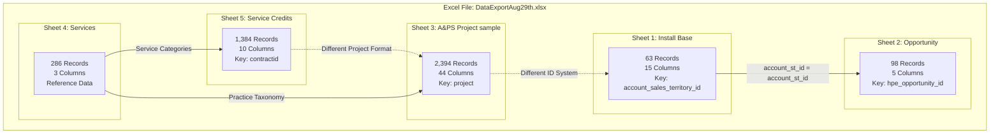
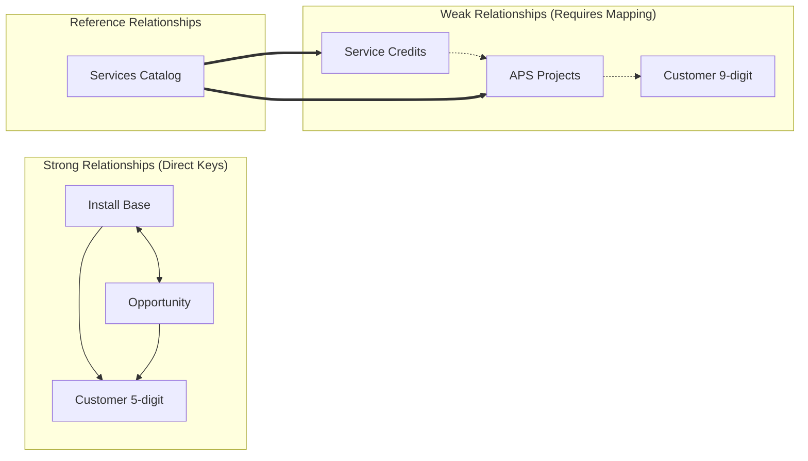
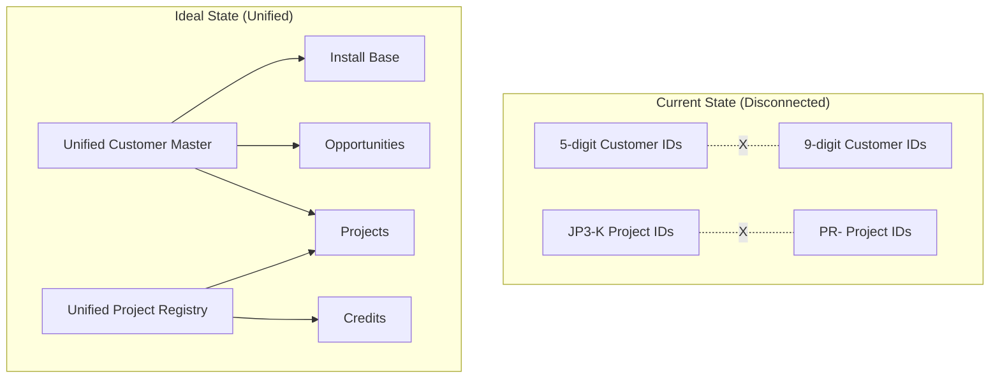

# Excel Data Analysis: DataExportAug29th.xlsx

## Executive Summary

This document provides a comprehensive analysis of the HPE data export file containing 5 interconnected sheets that track different aspects of customer engagement, from installed products to professional services delivery.

## Table of Contents
- [Sheet Overview](#sheet-overview)
- [Data Structure](#data-structure)
- [Relationship Mapping](#relationship-mapping)
- [Key Findings](#key-findings)
- [Data Integration Challenges](#data-integration-challenges)
- [Recommendations](#recommendations)

---

## Sheet Overview

### 1. Install Base (63 records)
**Purpose**: Tracks HPE products/equipment installed at customer sites

**Key Metrics**:
- 10 unique customer accounts
- 19 unique products
- 15 data columns
- Primary platforms: Network, Compute

**Critical Fields**:
- `Account_Sales_Territory_Id` - Customer identifier
- `Product_Id` - Product identifier
- `Product_Platform_Description_Name` - Product category
- `Product_End_of_Life_Date` - EOL tracking
- `Support_Status` - Current support state

### 2. Opportunity (98 records)
**Purpose**: Sales opportunities for existing/potential customers

**Key Metrics**:
- 8 unique customer accounts
- 5 data columns
- Multiple product lines tracked

**Critical Fields**:
- `Account ST ID` - Customer identifier (links to Install Base)
- `HPE Opportunity ID` - Unique opportunity identifier
- `Product Line` - Target product category

### 3. A&PS Project Sample (2,394 records)
**Purpose**: Advisory & Professional Services projects delivered to customers

**Key Metrics**:
- 3 unique customer IDs (different numbering system)
- 44 data columns
- All projects in Japan
- Primary practices: CLD & PLT, NTWK & CYB, AI & D

**Critical Fields**:
- `PRJ Customer ID` - Customer identifier (9-digit format)
- `Project` - Project identifier (JP3-Kxxxx format)
- `PRJ Practice` - Service practice area
- `PRJ Start Date` / `PRJ End Date` - Project timeline

### 4. Services (286 records)
**Purpose**: Service catalog/taxonomy reference data

**Key Metrics**:
- 3 unique practice areas
- Complete service hierarchy
- Reference data for service offerings

**Critical Fields**:
- `Practice` - High-level service category
- `Sub-Practice` - Service subcategory
- `Services` - Specific service offerings

### 5. Service Credits (1,384 records)
**Purpose**: Purchased service credits and their utilization per project

**Key Metrics**:
- 1,384 unique projects
- 650 total purchased credits
- 320 delivered credits
- 49% utilization rate

**Critical Fields**:
- `ProjectID` - Project identifier (PR-xxxxxxx format)
- `PurchasedCredits` - Credits bought
- `DeliveredCredits` - Credits consumed
- `ContractEndDate` - Contract expiration

---

## Data Structure

### Customer Identifier Systems

| System | Format | Used By | Example |
|--------|--------|---------|---------|
| System 1 | 5-digit | Install Base, Opportunity | 56088, 56769 |
| System 2 | 9-digit | A&PS Projects | 110079582, 110085660 |

### Project Identifier Systems

| System | Format | Used By | Example |
|--------|--------|---------|---------|
| A&PS Format | JP3-Kxxxx | A&PS Projects | JP3-K1447 |
| Service Credit Format | PR-xxxxxxx | Service Credits | PR-2107153 |

### Practice Naming Conventions

| Sheet | Practice Names |
|-------|----------------|
| Services | Hybrid Cloud Engineering, Data AI & IOT |
| A&PS Projects | CLD & PLT, NTWK & CYB, AI & D |
| Service Credits | Technical Services, PS - HPE Complete Care |

---

## Entity Relationship Diagram (ERD)

### Conceptual Data Model



### Physical Data Model (Current State)



## Relationship Mapping

### Data Relationships Matrix

| Parent Entity | Child Entity | Relationship Type | Join Key | Cardinality | Data Quality |
|---------------|--------------|-------------------|----------|-------------|---------------|
| CUSTOMER | INSTALL_BASE | Ownership | account_sales_territory_id | 1:M | ✅ Direct match |
| CUSTOMER | OPPORTUNITY | Sales Pipeline | account_st_id | 1:M | ✅ Direct match |
| CUSTOMER | APS_PROJECT | Service Delivery | customer_id (different system) | 1:M | ⚠️ Requires mapping |
| APS_PROJECT | SERVICE_CREDITS | Funding | project_id (different format) | 1:M | ⚠️ Requires mapping |
| SERVICES | APS_PROJECT | Categorization | practice | 1:M | ⚠️ Inconsistent naming |
| SERVICES | SERVICE_CREDITS | Service Type | service description | 1:M | ⚠️ Indirect link |
| INSTALL_BASE | OPPORTUNITY | Cross-sell/Upsell | account_id | M:M | ✅ Via customer |

### Discovered Relationships



### Relationship Details

#### 1. Strong Relationships (Direct Foreign Keys)

##### **Install Base ↔ Opportunity**
- **Join Condition**: `Install_Base.Account_Sales_Territory_Id = Opportunity.Account_ST_ID`
- **Type**: Many-to-Many (through Customer entity)
- **Coverage**: 8 of 10 Install Base accounts (80%) have opportunities
- **Business Meaning**: Installed products drive new sales opportunities

```sql
-- Example Join Query
SELECT 
    ib.account_sales_territory_id,
    COUNT(DISTINCT ib.product_serial_number) as installed_products,
    COUNT(DISTINCT op.hpe_opportunity_id) as active_opportunities
FROM install_base ib
LEFT JOIN opportunity op 
    ON ib.account_sales_territory_id = op.account_st_id
GROUP BY ib.account_sales_territory_id;
```

#### 2. Weak Relationships (Requires Data Mapping)

##### **A&PS Projects ↔ Install Base/Opportunity**
- **Challenge**: Different customer ID systems
  - Install Base: 5-digit IDs (e.g., 56088)
  - A&PS Projects: 9-digit IDs (e.g., 110079582)
- **Solution Required**: Customer master mapping table
- **Business Impact**: Cannot directly link services to product installations

##### **Service Credits ↔ A&PS Projects**
- **Challenge**: Different project ID formats
  - A&PS Projects: JP3-Kxxxx format
  - Service Credits: PR-xxxxxxx format
- **Temporal Link**: Date ranges overlap suggesting relationship
- **Business Impact**: Cannot track credit consumption by specific project

#### 3. Reference Relationships

##### **Services Catalog ↔ Project/Credit Sheets**
- **Type**: Lookup/Reference data
- **Purpose**: Standardize service categorization
- **Challenge**: Inconsistent naming across sheets:
  - Services: "Hybrid Cloud Engineering"
  - A&PS: "CLD & PLT"
  - Credits: "Technical Services"

### Entity Cardinality Analysis

| Relationship | Type | Cardinality | Business Rule |
|--------------|------|-------------|----------------|
| Customer → Install Base | Ownership | 1:M | One customer has multiple installations |
| Customer → Opportunity | Pipeline | 1:M | One customer has multiple opportunities |
| Install Base → Support | Coverage | 1:1 | Each installation has one support status |
| Project → Service Credits | Funding | 1:M | One project may use multiple credit contracts |
| Services → Projects | Classification | 1:M | One service type delivered in multiple projects |

---

## Key Findings

### 1. Data Coverage
- **Customer Coverage**: Only 8 of 10 Install Base accounts have opportunities
- **Geographic Focus**: 100% of A&PS projects are in Japan
- **Service Utilization**: 49% of purchased service credits have been delivered

### 2. Timeline Analysis
- **Install Base EOL**: Ranges from 2009 to 2099 (includes placeholder dates)
- **Project Timeline**: 2012 to 2025 (13-year span)
- **Service Credits**: Contracts extending to 2099

### 3. Data Quality Indicators
- **Install Base**: Complete product tracking with EOL dates
- **Opportunity**: Minimal fields but complete account linkage
- **A&PS Projects**: Rich 44-column dataset with project details
- **Service Credits**: Good utilization tracking

---

## Data Model Insights

### Current State vs. Ideal State



### Missing Entities (Gap Analysis)

Based on the ER analysis, the following entities should exist but are missing:

1. **CUSTOMER_MASTER**
   - Unified customer identifier
   - Customer hierarchy (parent/child relationships)
   - Geographic information
   - Industry classification

2. **PRODUCT_CATALOG**
   - Complete product hierarchy
   - Product lifecycle stages
   - Replacement product mappings
   - List prices and configurations

3. **PROJECT_REGISTRY**
   - Unified project tracking
   - Project financials (value, margin)
   - Resource allocation
   - Deliverables and milestones

4. **FINANCIAL_FACTS**
   - Opportunity values
   - Contract amounts
   - Revenue recognition
   - Profitability metrics

## Data Integration Challenges

### 1. Identifier Inconsistency
- **Problem**: Multiple customer ID systems prevent unified customer view
- **Impact**: Cannot directly link professional services to product installations
- **Solution Needed**: Customer ID mapping table

### 2. Project Tracking Disconnect
- **Problem**: Different project ID formats (JP3-K vs PR-)
- **Impact**: Cannot correlate service credit consumption with specific A&PS projects
- **Solution Needed**: Project ID mapping or common project registry

### 3. Practice Taxonomy Variations
- **Problem**: Inconsistent practice naming across sheets
- **Impact**: Difficult to aggregate services by practice area
- **Solution Needed**: Standardized practice taxonomy mapping

### 4. Missing Linkage Points
- **A&PS Projects** isolated from Install Base/Opportunity
- **Service Credits** isolated from actual projects
- No revenue/financial data to measure opportunity value

---

*Analysis Date: September 2025*
*File: DataExportAug29th.xlsx*
*Location: /Users/jjayaraj/workspaces/HPE/onelead_system/data/*