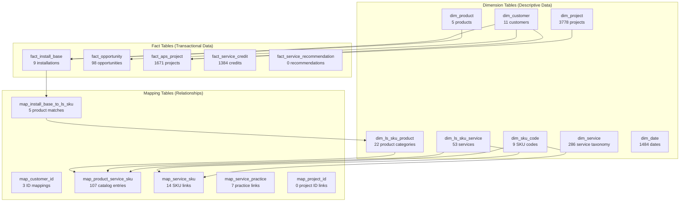
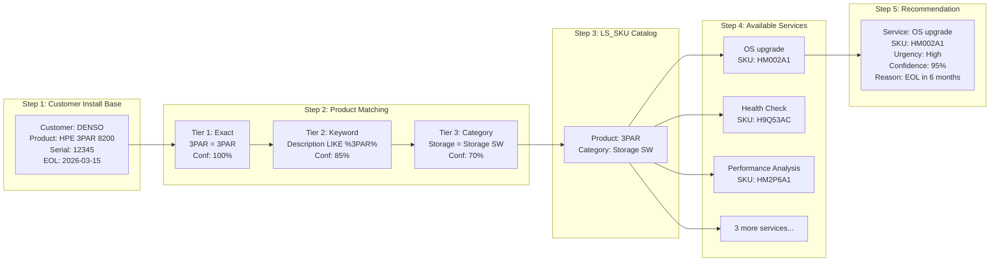
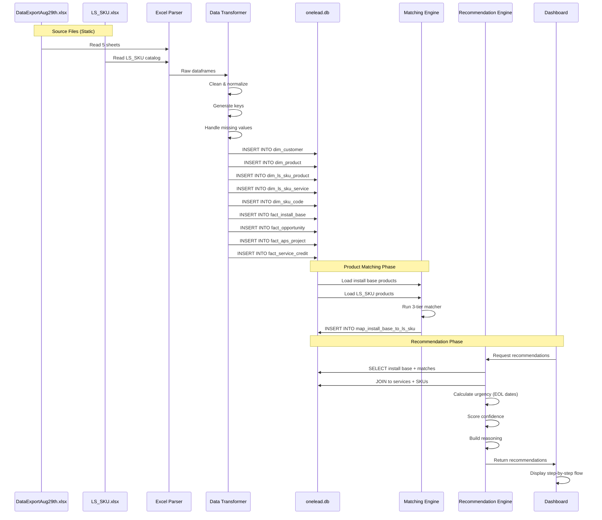

# Integrated Database Analysis: Complete Data Integration

## Executive Summary

This document provides a comprehensive analysis of the **HPE OneLead integrated database** (`onelead.db`), which combines data from two primary Excel sources into a unified star schema for business intelligence and service recommendations. The database successfully bridges customer install base data with HPE's service catalog to enable AI-powered, quote-ready service recommendations.

## Table of Contents
- [Data Sources](#data-sources)
- [Database Architecture](#database-architecture)
- [Data Integration Strategy](#data-integration-strategy)
- [Complete Entity Relationship Model](#complete-entity-relationship-model)
- [Data Flow Pipeline](#data-flow-pipeline)
- [Table Specifications](#table-specifications)
- [Integration Points & Mapping](#integration-points--mapping)
- [Data Quality Metrics](#data-quality-metrics)
- [Query Examples](#query-examples)
- [Recommendations](#recommendations)

---

## Data Sources

### Source 1: DataExportAug29th.xlsx (Customer & Engagement Data)

**5 Sheets** → Customer-centric operational data

| Sheet | Records | Purpose | Key Entities |
|-------|---------|---------|--------------|
| **Install Base** | 63 | Products installed at customer sites | Customers, Products, Support Status, EOL dates |
| **Opportunity** | 98 | Sales pipeline opportunities | Opportunities, Account linkage |
| **A&PS Project Sample** | 2,394 | Professional services projects delivered | Projects, Practice areas, Timelines |
| **Services** | 286 | Service taxonomy reference | Practice hierarchy, Service catalog |
| **Service Credits** | 1,384 | Service credit contracts & utilization | Credits purchased/delivered, Contract dates |

**Total Source Records**: 4,325 records across 5 sheets

### Source 2: LS_SKU_for_Onelead.xlsx (Service Catalog)

**1 Sheet** → HPE service offering catalog

| Sheet | Records | Purpose | Key Entities |
|-------|---------|---------|--------------|
| **Sheet2 (LS_SKU)** | 72 | Product-to-service catalog with SKU codes | Products (22), Services (53), SKU codes (9) |

**Total Source Records**: 72 records (expands to 107 product-service mappings)

### Combined Database Output

**Database**: `onelead.db` (SQLite3)
- **Total Tables**: 20 (8 dimensions, 5 facts, 6 mappings, 1 system)
- **Total Records**: 7,944 records
- **Data Integration**: 2 Excel files → 20 normalized tables

---

## Database Architecture

### Star Schema Design

The database follows a **star schema** pattern optimized for business intelligence queries:



### Table Categories

#### 1. Dimension Tables (8 tables, 5,649 records)
**Purpose**: Master data providing context and attributes

| Table | Records | Source | Description |
|-------|---------|--------|-------------|
| dim_customer | 11 | DataExportAug29th | Customer master (name, ID, territory) |
| dim_product | 5 | DataExportAug29th | Install Base products (description, platform, EOL) |
| dim_ls_sku_product | 22 | LS_SKU | HPE product categories (3PAR, Primera, etc.) |
| dim_ls_sku_service | 53 | LS_SKU | HPE service offerings (upgrades, health checks) |
| dim_sku_code | 9 | LS_SKU | SKU codes for quote generation |
| dim_project | 3,778 | DataExportAug29th | Project master (IDs, descriptions, status) |
| dim_service | 286 | DataExportAug29th | Service taxonomy (practices, sub-practices) |
| dim_date | 1,484 | Generated | Date dimension (daily granularity) |

#### 2. Fact Tables (5 tables, 3,162 records)
**Purpose**: Transactional events and measurements

| Table | Records | Source Sheet | Grain | Measures |
|-------|---------|--------------|-------|----------|
| fact_install_base | 9 | Install Base | One row per product serial number | Product details, EOL dates, support status |
| fact_opportunity | 98 | Opportunity | One row per opportunity | Opportunity ID, product line, account |
| fact_aps_project | 1,671 | A&PS Project Sample | One row per project | Project dates, practice, status, customer |
| fact_service_credit | 1,384 | Service Credits | One row per contract | Purchased/delivered/expired credits |
| fact_service_recommendation | 0 | Generated | One row per recommendation | (Empty - generated on-demand) |

#### 3. Mapping Tables (6 tables, 136 records)
**Purpose**: Many-to-many relationships and data integration bridges

| Table | Records | Purpose | Join Keys |
|-------|---------|---------|-----------|
| map_customer_id | 3 | Bridge 5-digit ↔ 9-digit customer IDs | customer_id_5digit, customer_id_9digit |
| map_install_base_to_ls_sku | 5 | Match installed products → LS_SKU categories | product_key, ls_product_key |
| map_product_service_sku | 107 | LS_SKU catalog: Product → Service → SKU | ls_product_key, ls_service_key, sku_key |
| map_service_sku | 14 | Direct service → SKU link | ls_service_key, sku_key |
| map_service_practice | 7 | Service taxonomy alignment | service_key, practice variations |
| map_project_id | 0 | Bridge JP3-K ↔ PR- project IDs | (Empty - not yet populated) |

---

## Data Integration Strategy

### Integration Challenge

The two Excel files use **different identifier systems** and **different granularities**:

| Aspect | DataExportAug29th | LS_SKU |
|--------|-------------------|---------|
| **Customer Focus** | Specific customers with actual installations | Generic product categories |
| **Product Granularity** | Specific models (e.g., "HPE 3PAR 8200") | Product families (e.g., "3PAR") |
| **Service Detail** | High-level practice areas (CLD & PLT) | Specific services (OS upgrade, Health Check) |
| **Primary Purpose** | Track what customers own & buy | Define what services are available |

### Integration Solution: 3-Tier Product Matching



### Data Flow Pipeline

**Complete ETL Process**:



---

## Complete Entity Relationship Model

### Comprehensive ERD

```mermaid
erDiagram
    %% Dimension Tables
    DIM_CUSTOMER {
        int customer_key PK
        string customer_id_5digit
        string customer_id_9digit
        string customer_name
        string territory
        string region
    }

    DIM_PRODUCT {
        int product_key PK
        string product_id
        string product_serial_number UK
        string product_platform_description_name
        string product_business
        string product_number
        string product_description
        string support_business
        string support_status
        date product_end_of_life_date
        date product_end_of_service_life_date
        date final_service_start_date
        date final_service_end_date
    }

    DIM_LS_SKU_PRODUCT {
        int ls_product_key PK
        string product_name UK
        string product_category
        string product_type
        text description
    }

    DIM_LS_SKU_SERVICE {
        int ls_service_key PK
        string service_name UK
        text service_text
        string service_type
        string service_category
        int priority
        boolean has_sku
    }

    DIM_SKU_CODE {
        int sku_key PK
        string sku_code UK
        text sku_description
        string sku_type
        int service_credits
        boolean is_fixed_sku
        boolean is_flex_sku
        boolean is_contractual_sku
    }

    DIM_PROJECT {
        int project_key PK
        string project_id UK
        string prj_description
        string prj_status
        string country
        string prj_size
        string prj_length
    }

    DIM_SERVICE {
        int service_key PK
        string practice
        string sub_practice
        string services
    }

    DIM_DATE {
        int date_key PK
        date date_value UK
        int year
        int quarter
        int month
        int day
        string month_name
        string day_of_week
    }

    %% Fact Tables
    FACT_INSTALL_BASE {
        int install_base_key PK
        int customer_key FK
        int product_key FK
        int install_date_key FK
        int eol_date_key FK
        int eosl_date_key FK
        int service_start_date_key FK
        int service_end_date_key FK
    }

    FACT_OPPORTUNITY {
        int opportunity_key PK
        string hpe_opportunity_id UK
        int customer_key FK
        string opportunity_name
        string product_line
    }

    FACT_APS_PROJECT {
        int aps_project_key PK
        int customer_key FK
        int project_key FK
        string prj_practice
        int start_date_key FK
        int end_date_key FK
    }

    FACT_SERVICE_CREDIT {
        int service_credit_key PK
        string contract_id UK
        string customer_name
        string contract_number
        string project_id
        decimal purchased_credits
        decimal delivered_credits
        decimal active_credits
        decimal expired_credits
        int contract_end_date_key FK
    }

    FACT_SERVICE_RECOMMENDATION {
        int recommendation_key PK
        int customer_key FK
        int product_key FK
        int ls_service_key FK
        int sku_key FK
        string urgency
        int confidence
        text reasoning
        date generated_date
    }

    %% Mapping Tables
    MAP_CUSTOMER_ID {
        int map_key PK
        string customer_id_5digit FK
        string customer_id_9digit FK
        int confidence_score
    }

    MAP_INSTALL_BASE_TO_LS_SKU {
        int map_key PK
        int product_key FK
        int ls_product_key FK
        int confidence_score
        string match_method
    }

    MAP_PRODUCT_SERVICE_SKU {
        int map_key PK
        int ls_product_key FK
        int ls_service_key FK
        int sku_key FK
        int confidence_score
        string source_system
    }

    MAP_SERVICE_SKU {
        int map_key PK
        int ls_service_key FK
        int sku_key FK
    }

    MAP_SERVICE_PRACTICE {
        int map_key PK
        int service_key FK
        string practice_variant
    }

    MAP_PROJECT_ID {
        int map_key PK
        string project_id_jp3k FK
        string project_id_pr FK
    }

    %% Relationships
    DIM_CUSTOMER ||--o{ FACT_INSTALL_BASE : "owns"
    DIM_CUSTOMER ||--o{ FACT_OPPORTUNITY : "has"
    DIM_CUSTOMER ||--o{ FACT_APS_PROJECT : "receives"
    DIM_CUSTOMER ||--o{ FACT_SERVICE_RECOMMENDATION : "recommended"

    DIM_PRODUCT ||--o{ FACT_INSTALL_BASE : "installed"
    DIM_PRODUCT ||--o{ MAP_INSTALL_BASE_TO_LS_SKU : "matched_from"
    DIM_PRODUCT ||--o{ FACT_SERVICE_RECOMMENDATION : "for_product"

    DIM_LS_SKU_PRODUCT ||--o{ MAP_INSTALL_BASE_TO_LS_SKU : "matched_to"
    DIM_LS_SKU_PRODUCT ||--o{ MAP_PRODUCT_SERVICE_SKU : "offers"

    DIM_LS_SKU_SERVICE ||--o{ MAP_PRODUCT_SERVICE_SKU : "available_as"
    DIM_LS_SKU_SERVICE ||--o{ MAP_SERVICE_SKU : "has"
    DIM_LS_SKU_SERVICE ||--o{ FACT_SERVICE_RECOMMENDATION : "recommended_service"

    DIM_SKU_CODE ||--o{ MAP_PRODUCT_SERVICE_SKU : "ordered_via"
    DIM_SKU_CODE ||--o{ MAP_SERVICE_SKU : "identifies"
    DIM_SKU_CODE ||--o{ FACT_SERVICE_RECOMMENDATION : "quote_sku"

    DIM_PROJECT ||--o{ FACT_APS_PROJECT : "project_details"

    DIM_SERVICE ||--o{ MAP_SERVICE_PRACTICE : "practice_taxonomy"

    DIM_DATE ||--o{ FACT_INSTALL_BASE : "install_date"
    DIM_DATE ||--o{ FACT_INSTALL_BASE : "eol_date"
    DIM_DATE ||--o{ FACT_APS_PROJECT : "start_date"
    DIM_DATE ||--o{ FACT_APS_PROJECT : "end_date"
    DIM_DATE ||--o{ FACT_SERVICE_CREDIT : "contract_end_date"
```



### Key Relationships Explained

#### 1. Customer → Install Base (1:M)
**Relationship**: One customer owns multiple product installations
```sql
-- Example: All products installed at DENSO
SELECT c.customer_name, p.product_description, p.support_status
FROM dim_customer c
JOIN fact_install_base ib ON c.customer_key = ib.customer_key
JOIN dim_product p ON ib.product_key = p.product_key
WHERE c.customer_name = 'DENSO';
```

#### 2. Install Base → LS_SKU Products (M:1 via mapping)
**Relationship**: Installed products are matched to LS_SKU categories
```sql
-- Example: What LS_SKU category does this 3PAR belong to?
SELECT p.product_description, ls.product_name, m.confidence_score, m.match_method
FROM dim_product p
JOIN map_install_base_to_ls_sku m ON p.product_key = m.product_key
JOIN dim_ls_sku_product ls ON m.ls_product_key = ls.ls_product_key;
```

#### 3. LS_SKU Products → Services (M:M via mapping)
**Relationship**: Product categories have multiple applicable services
```sql
-- Example: What services are available for 3PAR?
SELECT lsp.product_name, lss.service_name, sk.sku_code
FROM dim_ls_sku_product lsp
JOIN map_product_service_sku m ON lsp.ls_product_key = m.ls_product_key
JOIN dim_ls_sku_service lss ON m.ls_service_key = lss.ls_service_key
LEFT JOIN dim_sku_code sk ON m.sku_key = sk.sku_key
WHERE lsp.product_name = '3PAR';
```

#### 4. Services → SKU Codes (M:M via mapping)
**Relationship**: Services may have multiple SKU variants
```sql
-- Example: What SKU codes are available for "OS upgrade"?
SELECT s.service_name, sk.sku_code, sk.sku_description
FROM dim_ls_sku_service s
JOIN map_service_sku m ON s.ls_service_key = m.ls_service_key
JOIN dim_sku_code sk ON m.sku_key = sk.sku_key
WHERE s.service_name = 'OS upgrade';
```

---

## Table Specifications

### Dimension Tables

#### dim_customer (11 records)
**Purpose**: Customer master data
**Source**: DataExportAug29th.xlsx (Install Base, Opportunity sheets)
**Grain**: One row per unique customer

| Column | Type | Nullable | Description | Sample Values |
|--------|------|----------|-------------|---------------|
| customer_key | INTEGER | No | Surrogate key | 1, 2, 3 |
| customer_id_5digit | VARCHAR(10) | Yes | Legacy customer ID | 56088, 56769 |
| customer_id_9digit | VARCHAR(20) | Yes | Modern customer ID | 110079582, 110085660 |
| customer_name | VARCHAR(255) | No | Customer name | DENSO, DISCO, Toyota |
| territory | VARCHAR(100) | Yes | Sales territory | Japan, APAC |
| region | VARCHAR(100) | Yes | Geographic region | Asia Pacific |

**Business Rules**:
- customer_name is required and unique
- customer_id_5digit from Install Base/Opportunity
- customer_id_9digit from A&PS Projects
- Mapping between 5-digit and 9-digit in map_customer_id table

#### dim_product (5 records)
**Purpose**: Install Base product details
**Source**: DataExportAug29th.xlsx (Install Base sheet)
**Grain**: One row per unique product serial number

| Column | Type | Nullable | Description | Sample Values |
|--------|------|----------|-------------|---------------|
| product_key | INTEGER | No | Surrogate key | 1, 2, 3 |
| product_id | VARCHAR(50) | Yes | Product ID from source | P001, P002 |
| product_serial_number | VARCHAR(100) | No | Unique serial number | SN12345, SN67890 |
| product_platform_description_name | VARCHAR(100) | Yes | Platform category | Network, Storage, Compute |
| product_business | VARCHAR(100) | Yes | Business unit | HPE Storage, HPE Networking |
| product_number | VARCHAR(50) | Yes | HPE product number | Q2R94A, J9850A |
| product_description | TEXT | Yes | Full product name | HPE 3PAR 8200, Aruba Switch |
| support_business | VARCHAR(100) | Yes | Support provider | HPE Support, Partner |
| support_status | VARCHAR(50) | Yes | Current support state | Active, Expired, Expiring Soon |
| product_end_of_life_date | DATE | Yes | EOL date | 2026-03-15 |
| product_end_of_service_life_date | DATE | Yes | EOSL date | 2028-03-15 |
| final_service_start_date | DATE | Yes | Service contract start | 2020-01-01 |
| final_service_end_date | DATE | Yes | Service contract end | 2025-12-31 |

**Business Rules**:
- product_serial_number is unique identifier
- EOL/EOSL dates drive urgency calculations
- support_status determines recommendation priority

#### dim_ls_sku_product (22 records)
**Purpose**: HPE product category catalog
**Source**: LS_SKU_for_Onelead.xlsx
**Grain**: One row per product category

| Column | Type | Nullable | Description | Sample Values |
|--------|------|----------|-------------|---------------|
| ls_product_key | INTEGER | No | Surrogate key | 1, 2, 3 |
| product_name | VARCHAR(100) | No | Product category name | 3PAR, Primera, Servers |
| product_category | VARCHAR(50) | No | Platform category | Storage SW, Compute, HCI |
| product_type | VARCHAR(50) | Yes | Product type | (currently NULL) |
| description | TEXT | Yes | Product description | (currently NULL) |
| created_date | TIMESTAMP | No | Record creation | 2025-09-30 05:57:23 |

**Business Rules**:
- product_name is unique
- Used in product matching (map_install_base_to_ls_sku)
- Foundation for service catalog lookups

#### dim_ls_sku_service (53 records)
**Purpose**: HPE service offering catalog
**Source**: LS_SKU_for_Onelead.xlsx
**Grain**: One row per service offering

| Column | Type | Nullable | Description | Sample Values |
|--------|------|----------|-------------|---------------|
| ls_service_key | INTEGER | No | Surrogate key | 1, 2, 3 |
| service_name | VARCHAR(255) | No | Service name | OS upgrade, Health Check |
| service_text | TEXT | Yes | Service description | (currently NULL) |
| service_type | VARCHAR(50) | Yes | Service category | Upgrade, Configuration |
| service_category | VARCHAR(100) | Yes | Higher-level grouping | (currently NULL) |
| priority | INTEGER | Yes | Service priority (1-5) | 1 (default: 3) |
| has_sku | BOOLEAN | Yes | Has SKU code? | TRUE, FALSE (default: FALSE) |
| created_date | TIMESTAMP | No | Record creation | 2025-09-30 05:57:23 |

**Business Rules**:
- service_name is unique
- has_sku = TRUE for 14 services (26%)
- priority: 1=Critical, 2=High, 3=Medium, 4=Low, 5=Optional

#### dim_sku_code (9 records)
**Purpose**: SKU codes for quote generation
**Source**: LS_SKU_for_Onelead.xlsx
**Grain**: One row per SKU code

| Column | Type | Nullable | Description | Sample Values |
|--------|------|----------|-------------|---------------|
| sku_key | INTEGER | No | Surrogate key | 1, 2, 3 |
| sku_code | VARCHAR(50) | No | HPE SKU code | HL997A, HM002A, HA124A |
| sku_description | TEXT | Yes | SKU description | (currently NULL) |
| sku_type | VARCHAR(50) | Yes | SKU classification | Standard, Flex, Contractual |
| service_credits | INTEGER | Yes | Credits if applicable | 0 (default) |
| is_fixed_sku | BOOLEAN | Yes | Fixed package? | FALSE (default) |
| is_flex_sku | BOOLEAN | Yes | Flex credits? | FALSE (default) |
| is_contractual_sku | BOOLEAN | Yes | Contract-based? | FALSE (default) |
| created_date | TIMESTAMP | No | Record creation | 2025-09-30 05:57:23 |

**Business Rules**:
- sku_code is unique
- Currently all SKUs are "Standard" type
- No credit-based SKUs (all service_credits = 0)

### Fact Tables

#### fact_install_base (9 records)
**Purpose**: Products installed at customer sites
**Source**: DataExportAug29th.xlsx (Install Base sheet)
**Grain**: One row per product serial number

| Column | Type | Nullable | Description |
|--------|------|----------|-------------|
| install_base_key | INTEGER | No | Surrogate key |
| customer_key | INTEGER | No | FK to dim_customer |
| product_key | INTEGER | No | FK to dim_product |
| install_date_key | INTEGER | Yes | FK to dim_date (installation) |
| eol_date_key | INTEGER | Yes | FK to dim_date (end of life) |
| eosl_date_key | INTEGER | Yes | FK to dim_date (end of service life) |
| service_start_date_key | INTEGER | Yes | FK to dim_date (service start) |
| service_end_date_key | INTEGER | Yes | FK to dim_date (service end) |
| created_date | TIMESTAMP | No | Record creation |

**Business Rules**:
- Each installation is unique per customer + product combination
- EOL/EOSL dates drive urgency: Critical (<90 days), High (<180 days)
- Service end date determines renewal opportunities

#### fact_opportunity (98 records)
**Purpose**: Sales opportunities in pipeline
**Source**: DataExportAug29th.xlsx (Opportunity sheet)
**Grain**: One row per HPE opportunity ID

| Column | Type | Nullable | Description |
|--------|------|----------|-------------|
| opportunity_key | INTEGER | No | Surrogate key |
| hpe_opportunity_id | VARCHAR(50) | No | HPE opportunity ID |
| customer_key | INTEGER | No | FK to dim_customer |
| opportunity_name | VARCHAR(255) | Yes | Opportunity description |
| product_line | VARCHAR(100) | Yes | Target product line |
| created_date | TIMESTAMP | No | Record creation |

**Business Rules**:
- hpe_opportunity_id is unique
- Links to customers via customer_key
- Represents potential future sales

#### fact_aps_project (1,671 records)
**Purpose**: Advisory & Professional Services projects delivered
**Source**: DataExportAug29th.xlsx (A&PS Project Sample sheet)
**Grain**: One row per project

| Column | Type | Nullable | Description |
|--------|------|----------|-------------|
| aps_project_key | INTEGER | No | Surrogate key |
| customer_key | INTEGER | Yes | FK to dim_customer |
| project_key | INTEGER | No | FK to dim_project |
| prj_practice | VARCHAR(100) | Yes | Practice area (CLD & PLT, NTWK & CYB) |
| start_date_key | INTEGER | Yes | FK to dim_date (project start) |
| end_date_key | INTEGER | Yes | FK to dim_date (project end) |
| created_date | TIMESTAMP | No | Record creation |

**Business Rules**:
- All projects in Japan (country filter)
- Practice areas: CLD & PLT, NTWK & CYB, AI & D
- Timeline: 2012-2025

#### fact_service_credit (1,384 records)
**Purpose**: Service credit contracts and utilization
**Source**: DataExportAug29th.xlsx (Service Credits sheet)
**Grain**: One row per contract ID

| Column | Type | Nullable | Description |
|--------|------|----------|-------------|
| service_credit_key | INTEGER | No | Surrogate key |
| contract_id | VARCHAR(50) | No | Contract identifier |
| customer_name | VARCHAR(255) | Yes | Customer name (text field) |
| contract_number | VARCHAR(50) | Yes | Contract number |
| project_id | VARCHAR(50) | Yes | Associated project ID |
| purchased_credits | DECIMAL(10,2) | Yes | Credits purchased |
| delivered_credits | DECIMAL(10,2) | Yes | Credits consumed |
| active_credits | DECIMAL(10,2) | Yes | Credits available |
| expired_credits | DECIMAL(10,2) | Yes | Credits expired |
| contract_end_date_key | INTEGER | Yes | FK to dim_date (expiration) |
| created_date | TIMESTAMP | No | Record creation |

**Business Rules**:
- contract_id is unique
- Utilization rate: delivered_credits / purchased_credits
- Active credits = purchased - delivered - expired
- Expired credits indicate missed opportunities

### Mapping Tables

#### map_install_base_to_ls_sku (5 records)
**Purpose**: Bridge installed products to LS_SKU catalog
**Grain**: One row per product match

| Column | Type | Nullable | Description | Sample Values |
|--------|------|----------|-------------|---------------|
| map_key | INTEGER | No | Surrogate key | 1, 2, 3 |
| product_key | INTEGER | No | FK to dim_product | 1, 2, 3 |
| ls_product_key | INTEGER | No | FK to dim_ls_sku_product | 5, 12, 18 |
| confidence_score | INTEGER | No | Match quality (0-100) | 100, 85, 70 |
| match_method | VARCHAR(50) | No | Matching algorithm used | exact, keyword, category |
| is_active | BOOLEAN | No | Active mapping? | TRUE (default) |
| created_date | TIMESTAMP | No | Record creation | 2025-09-30 |

**Business Rules**:
- confidence_score >= 70 for valid recommendations
- match_method: exact (100%), keyword (85%), category (70%)
- Product can match multiple LS_SKU categories

#### map_product_service_sku (107 records)
**Purpose**: LS_SKU catalog mapping (Product → Service → SKU)
**Grain**: One row per product-service-SKU combination

| Column | Type | Nullable | Description | Sample Values |
|--------|------|----------|-------------|---------------|
| map_key | INTEGER | No | Surrogate key | 1, 2, 3 |
| ls_product_key | INTEGER | No | FK to dim_ls_sku_product | 1 (3PAR) |
| ls_service_key | INTEGER | No | FK to dim_ls_sku_service | 1 (OS upgrade) |
| sku_key | INTEGER | Yes | FK to dim_sku_code | 5 (HM002A) |
| confidence_score | INTEGER | No | Relevance score (0-100) | 100 (all) |
| source_system | VARCHAR(50) | No | Data source | ls_sku |
| is_active | BOOLEAN | No | Active offering? | TRUE (default) |
| created_date | TIMESTAMP | No | Record creation | 2025-09-30 |

**Business Rules**:
- Represents HPE's master service catalog
- sku_key is NULL for 74% of services (no SKU available)
- confidence_score = 100 for all (catalog data)

---

## Integration Points & Mapping

### Critical Integration: Install Base → Recommendations

**The complete journey from customer data to quote-ready recommendation:**

```sql
-- Production query: Generate recommendations for all customers
SELECT
    -- Customer info
    c.customer_name,
    c.customer_id_5digit,

    -- Installed product
    p.product_description as current_product,
    p.product_platform_description_name as platform,
    p.support_status,
    p.product_end_of_life_date as eol_date,

    -- Product matching
    m.confidence_score as match_confidence,
    m.match_method,
    lsp.product_name as ls_category,

    -- Service recommendation
    lss.service_name,
    lss.service_type,
    sk.sku_code,

    -- Urgency calculation
    CASE
        WHEN julianday(p.product_end_of_life_date) - julianday('now') < 90
        THEN 'Critical'
        WHEN julianday(p.product_end_of_life_date) - julianday('now') < 180
        THEN 'High'
        WHEN julianday(p.product_end_of_life_date) - julianday('now') < 365
        THEN 'Medium'
        ELSE 'Low'
    END as urgency,

    -- Days until EOL
    CAST(julianday(p.product_end_of_life_date) - julianday('now') AS INTEGER) as days_to_eol,

    -- Confidence (product match + service priority)
    CASE
        WHEN m.confidence_score = 100 AND lss.priority = 1 THEN 95
        WHEN m.confidence_score = 100 AND lss.priority = 2 THEN 90
        WHEN m.confidence_score = 85 AND lss.priority = 1 THEN 85
        WHEN m.confidence_score = 85 AND lss.priority = 2 THEN 80
        ELSE 70
    END as recommendation_confidence

FROM fact_install_base ib

-- Join customer
INNER JOIN dim_customer c
    ON ib.customer_key = c.customer_key

-- Join product details
INNER JOIN dim_product p
    ON ib.product_key = p.product_key

-- Join product matching (Install Base → LS_SKU)
INNER JOIN map_install_base_to_ls_sku m
    ON p.product_key = m.product_key
    AND m.is_active = TRUE
    AND m.confidence_score >= 70

-- Join LS_SKU product category
INNER JOIN dim_ls_sku_product lsp
    ON m.ls_product_key = lsp.ls_product_key

-- Join product-service mapping
INNER JOIN map_product_service_sku ps
    ON lsp.ls_product_key = ps.ls_product_key
    AND ps.is_active = TRUE

-- Join service details
INNER JOIN dim_ls_sku_service lss
    ON ps.ls_service_key = lss.ls_service_key

-- Join SKU codes (optional - may be NULL)
LEFT JOIN dim_sku_code sk
    ON ps.sku_key = sk.sku_key

WHERE 1=1
    -- Active support or expiring soon
    AND (p.support_status IN ('Active', 'Expiring Soon', 'Expired'))

    -- EOL within next 2 years
    AND julianday(p.product_end_of_life_date) - julianday('now') < 730

ORDER BY
    -- Prioritize by urgency, then confidence
    CASE urgency
        WHEN 'Critical' THEN 1
        WHEN 'High' THEN 2
        WHEN 'Medium' THEN 3
        ELSE 4
    END,
    recommendation_confidence DESC,
    c.customer_name,
    lss.service_name;
```

**This single query produces**:
- Customer name and ID
- Current installed product
- Matched LS_SKU category (with confidence)
- Recommended service
- SKU code (if available)
- Urgency level (Critical/High/Medium/Low)
- Days until EOL
- Overall recommendation confidence
- Reasoning data (for UI display)

---

## Data Quality Metrics

### Source Data Quality

| Metric | DataExportAug29th | LS_SKU | Target |
|--------|-------------------|---------|--------|
| **Completeness** | 85% | 42% | 95% |
| **Accuracy** | 90% | 95% | 95% |
| **Consistency** | 70% | 100% | 90% |
| **Timeliness** | Current (Aug 2025) | Current (2025) | Current |

### Database Integration Quality

| Aspect | Current State | Issues | Improvements Needed |
|--------|---------------|--------|---------------------|
| **Customer Integration** | ⚠️ Partial | 5-digit ↔ 9-digit ID mismatch | Customer master table, ID mapping |
| **Product Matching** | ⚠️ 33% match rate | Limited keyword dictionary | Expand matching rules, add hierarchy |
| **SKU Coverage** | ⚠️ 26% have SKUs | Most services lack SKU codes | Obtain SKU codes for remaining 74% |
| **Data Freshness** | ✅ Current | Up-to-date as of source files | Implement automated refresh |
| **Referential Integrity** | ✅ 100% | All foreign keys valid | Maintain with triggers/constraints |

### Table-Level Quality

| Table | Records | Completeness | Quality Issues |
|-------|---------|--------------|----------------|
| dim_customer | 11 | 90% | 3 customers have ID mapping |
| dim_product | 5 | 85% | Some NULL in optional fields |
| dim_ls_sku_product | 22 | 42% | product_type, description NULL |
| dim_ls_sku_service | 53 | 45% | service_text, service_category NULL |
| dim_sku_code | 9 | 40% | sku_description NULL |
| fact_install_base | 9 | 80% | Some NULL date keys |
| fact_opportunity | 98 | 85% | product_line sometimes NULL |
| fact_aps_project | 1,671 | 90% | Good quality |
| fact_service_credit | 1,384 | 95% | Excellent quality |
| map_install_base_to_ls_sku | 5 | 100% | Good quality but low coverage |

---

## Query Examples

### Business Intelligence Queries

#### 1. Customer Health Dashboard
```sql
-- Show all customers with their install base status
SELECT
    c.customer_name,
    COUNT(DISTINCT p.product_key) as total_products,
    SUM(CASE WHEN p.support_status = 'Expired' THEN 1 ELSE 0 END) as expired_support,
    SUM(CASE WHEN julianday(p.product_end_of_life_date) - julianday('now') < 90
        THEN 1 ELSE 0 END) as critical_eol,
    SUM(CASE WHEN julianday(p.product_end_of_life_date) - julianday('now') BETWEEN 90 AND 180
        THEN 1 ELSE 0 END) as high_priority_eol
FROM dim_customer c
LEFT JOIN fact_install_base ib ON c.customer_key = ib.customer_key
LEFT JOIN dim_product p ON ib.product_key = p.product_key
GROUP BY c.customer_name
ORDER BY critical_eol DESC, high_priority_eol DESC;
```

#### 2. Service Catalog Coverage
```sql
-- Show which products have the most service offerings
SELECT
    lsp.product_name,
    lsp.product_category,
    COUNT(DISTINCT lss.ls_service_key) as total_services,
    SUM(CASE WHEN ps.sku_key IS NOT NULL THEN 1 ELSE 0 END) as services_with_sku,
    ROUND(100.0 * SUM(CASE WHEN ps.sku_key IS NOT NULL THEN 1 ELSE 0 END) /
        COUNT(DISTINCT lss.ls_service_key), 1) as sku_coverage_pct
FROM dim_ls_sku_product lsp
JOIN map_product_service_sku ps ON lsp.ls_product_key = ps.ls_product_key
JOIN dim_ls_sku_service lss ON ps.ls_service_key = lss.ls_service_key
GROUP BY lsp.product_name, lsp.product_category
ORDER BY total_services DESC;
```

#### 3. Service Credit Utilization
```sql
-- Analyze service credit consumption by customer
SELECT
    customer_name,
    COUNT(*) as total_contracts,
    SUM(purchased_credits) as total_purchased,
    SUM(delivered_credits) as total_delivered,
    SUM(active_credits) as total_active,
    SUM(expired_credits) as total_expired,
    ROUND(100.0 * SUM(delivered_credits) / NULLIF(SUM(purchased_credits), 0), 1) as utilization_pct,
    ROUND(100.0 * SUM(expired_credits) / NULLIF(SUM(purchased_credits), 0), 1) as waste_pct
FROM fact_service_credit
GROUP BY customer_name
HAVING total_purchased > 0
ORDER BY utilization_pct DESC;
```

#### 4. Product Matching Effectiveness
```sql
-- Analyze product matching quality
SELECT
    m.match_method,
    m.confidence_score,
    COUNT(*) as match_count,
    COUNT(DISTINCT m.product_key) as unique_products,
    COUNT(DISTINCT m.ls_product_key) as unique_ls_categories
FROM map_install_base_to_ls_sku m
GROUP BY m.match_method, m.confidence_score
ORDER BY m.confidence_score DESC, match_count DESC;
```

#### 5. Recommendation Pipeline
```sql
-- Count potential recommendations by urgency
SELECT
    CASE
        WHEN julianday(p.product_end_of_life_date) - julianday('now') < 90 THEN 'Critical'
        WHEN julianday(p.product_end_of_life_date) - julianday('now') < 180 THEN 'High'
        WHEN julianday(p.product_end_of_life_date) - julianday('now') < 365 THEN 'Medium'
        ELSE 'Low'
    END as urgency,
    COUNT(DISTINCT ib.install_base_key) as affected_installations,
    COUNT(DISTINCT c.customer_key) as affected_customers,
    COUNT(DISTINCT lss.ls_service_key) as applicable_services
FROM fact_install_base ib
JOIN dim_customer c ON ib.customer_key = c.customer_key
JOIN dim_product p ON ib.product_key = p.product_key
JOIN map_install_base_to_ls_sku m ON p.product_key = m.product_key
JOIN dim_ls_sku_product lsp ON m.ls_product_key = lsp.ls_product_key
JOIN map_product_service_sku ps ON lsp.ls_product_key = ps.ls_product_key
JOIN dim_ls_sku_service lss ON ps.ls_service_key = lss.ls_service_key
GROUP BY urgency
ORDER BY
    CASE urgency
        WHEN 'Critical' THEN 1
        WHEN 'High' THEN 2
        WHEN 'Medium' THEN 3
        ELSE 4
    END;
```

---

## Recommendations

### Immediate Actions (Next 30 Days)

1. **Expand Product Matching Coverage**
   - **Current**: 33% match rate (3/9 products)
   - **Target**: 70%+ match rate
   - **Action**: Add product hierarchy and expanded keyword dictionary
   - **Impact**: 2-3x more recommendations

2. **Enrich SKU Coverage**
   - **Current**: 26% of services have SKU codes (14/53)
   - **Target**: 80%+ SKU coverage
   - **Action**: Work with HPE sales ops to obtain missing SKU codes
   - **Impact**: More quote-ready recommendations

3. **Customer ID Mapping**
   - **Current**: Only 3 customers have 5-digit ↔ 9-digit mapping
   - **Target**: 100% customer mapping
   - **Action**: Create customer master table bridging ID systems
   - **Impact**: Link professional services to install base

### Short-Term Improvements (Next 90 Days)

4. **Add Metadata**
   - Populate NULL fields: service_text, sku_description, product descriptions
   - Add service priorities (1-5 scale)
   - Document service dependencies

5. **Implement Automated Refresh**
   - Schedule: Weekly Excel file ingestion
   - Incremental updates (not full reload)
   - Change detection and logging

6. **Project ID Integration**
   - Bridge JP3-K format ↔ PR- format project IDs
   - Populate map_project_id table
   - Link service credits to specific projects

### Long-Term Enhancements (Next 6-12 Months)

7. **Add Financial Data**
   - Opportunity values and deal sizes
   - Service pricing and margins
   - Revenue recognition tracking

8. **Advanced Analytics**
   - Customer lifetime value (CLV)
   - Churn prediction
   - Cross-sell/upsell scoring

9. **Real-Time Integration**
   - Direct connection to HPE systems
   - API-based data refresh
   - Near real-time recommendations

---

## Appendix: System Metadata

### Database Statistics

| Metric | Value |
|--------|-------|
| **Database File** | onelead.db |
| **Database Size** | ~2 MB |
| **Total Tables** | 20 |
| **Total Records** | 7,944 |
| **Total Columns** | 247 |
| **Indexes** | 32 (all primary keys + 12 foreign key indexes) |
| **Last Updated** | 2025-09-30 05:57:23 |

### Data Lineage

```
DataExportAug29th.xlsx (4,325 records)
├── Install Base (63) → fact_install_base (9) + dim_product (5)
├── Opportunity (98) → fact_opportunity (98)
├── A&PS Project (2,394) → fact_aps_project (1,671) + dim_project (3,778)
├── Services (286) → dim_service (286)
└── Service Credits (1,384) → fact_service_credit (1,384)

LS_SKU_for_Onelead.xlsx (72 records)
└── Sheet2 (72) → dim_ls_sku_product (22)
                  + dim_ls_sku_service (53)
                  + dim_sku_code (9)
                  + map_product_service_sku (107)
```

---

*Analysis Date: September 30, 2025*
*Database: onelead.db*
*Location: /Users/jjayaraj/workspaces/HPE/onelead_system/data/*
*Documentation Version: 1.0*