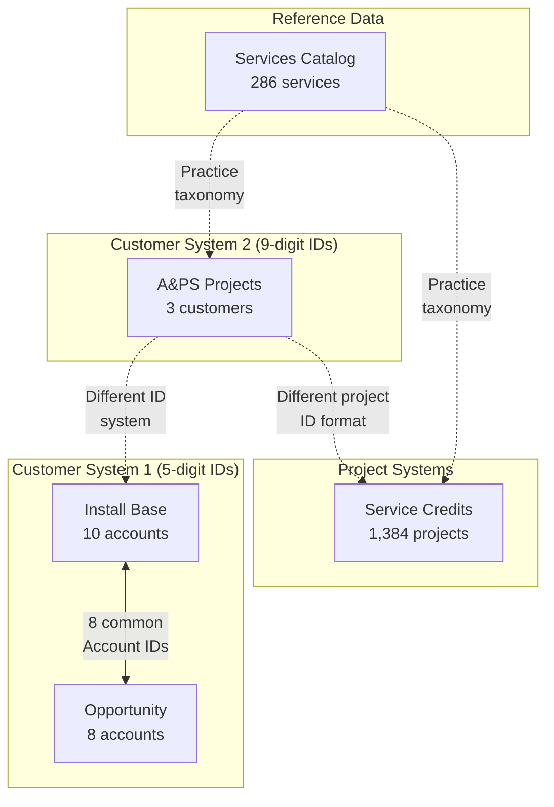

# Excel Data Analysis: DataExportAug29th.xlsx

## Executive Summary

This document provides a comprehensive analysis of the HPE data export file containing 5 interconnected sheets that track different aspects of customer engagement, from installed products to professional services delivery.

## Table of Contents
- [Sheet Overview](#sheet-overview)
- [Data Structure](#data-structure)
- [Relationship Mapping](#relationship-mapping)
- [Key Findings](#key-findings)
- [Data Integration Challenges](#data-integration-challenges)
- [Recommendations](#recommendations)

---

## Sheet Overview

### 1. Install Base (63 records)
**Purpose**: Tracks HPE products/equipment installed at customer sites

**Key Metrics**:
- 10 unique customer accounts
- 19 unique products
- 15 data columns
- Primary platforms: Network, Compute

**Critical Fields**:
- `Account_Sales_Territory_Id` - Customer identifier
- `Product_Id` - Product identifier
- `Product_Platform_Description_Name` - Product category
- `Product_End_of_Life_Date` - EOL tracking
- `Support_Status` - Current support state

### 2. Opportunity (98 records)
**Purpose**: Sales opportunities for existing/potential customers

**Key Metrics**:
- 8 unique customer accounts
- 5 data columns
- Multiple product lines tracked

**Critical Fields**:
- `Account ST ID` - Customer identifier (links to Install Base)
- `HPE Opportunity ID` - Unique opportunity identifier
- `Product Line` - Target product category

### 3. A&PS Project Sample (2,394 records)
**Purpose**: Advisory & Professional Services projects delivered to customers

**Key Metrics**:
- 3 unique customer IDs (different numbering system)
- 44 data columns
- All projects in Japan
- Primary practices: CLD & PLT, NTWK & CYB, AI & D

**Critical Fields**:
- `PRJ Customer ID` - Customer identifier (9-digit format)
- `Project` - Project identifier (JP3-Kxxxx format)
- `PRJ Practice` - Service practice area
- `PRJ Start Date` / `PRJ End Date` - Project timeline

### 4. Services (286 records)
**Purpose**: Service catalog/taxonomy reference data

**Key Metrics**:
- 3 unique practice areas
- Complete service hierarchy
- Reference data for service offerings

**Critical Fields**:
- `Practice` - High-level service category
- `Sub-Practice` - Service subcategory
- `Services` - Specific service offerings

### 5. Service Credits (1,384 records)
**Purpose**: Purchased service credits and their utilization per project

**Key Metrics**:
- 1,384 unique projects
- 650 total purchased credits
- 320 delivered credits
- 49% utilization rate

**Critical Fields**:
- `ProjectID` - Project identifier (PR-xxxxxxx format)
- `PurchasedCredits` - Credits bought
- `DeliveredCredits` - Credits consumed
- `ContractEndDate` - Contract expiration

---

## Data Structure

### Customer Identifier Systems

| System | Format | Used By | Example |
|--------|--------|---------|---------|
| System 1 | 5-digit | Install Base, Opportunity | 56088, 56769 |
| System 2 | 9-digit | A&PS Projects | 110079582, 110085660 |

### Project Identifier Systems

| System | Format | Used By | Example |
|--------|--------|---------|---------|
| A&PS Format | JP3-Kxxxx | A&PS Projects | JP3-K1447 |
| Service Credit Format | PR-xxxxxxx | Service Credits | PR-2107153 |

### Practice Naming Conventions

| Sheet | Practice Names |
|-------|----------------|
| Services | Hybrid Cloud Engineering, Data AI & IOT |
| A&PS Projects | CLD & PLT, NTWK & CYB, AI & D |
| Service Credits | Technical Services, PS - HPE Complete Care |

---

## Relationship Mapping

### Direct Relationships

1. **Install Base ↔ Opportunity**
   - Linked via: `Account_Sales_Territory_Id` = `Account ST ID`
   - 8 accounts have both installed products and active opportunities
   - Represents 80% of Install Base accounts having sales opportunities

### Indirect Relationships

2. **A&PS Projects ↔ Other Sheets**
   - Uses different customer ID system (9-digit vs 5-digit)
   - Likely represents different organizational hierarchy
   - No direct foreign key relationships

3. **Service Credits ↔ Projects**
   - Different project ID formats prevent direct linking
   - Both track professional services delivery
   - Temporal overlap in date ranges suggests related activities

4. **Services Catalog ↔ All Service Sheets**
   - Provides service taxonomy
   - Inconsistent naming conventions across sheets
   - Acts as reference data rather than transactional link

---

## Key Findings

### 1. Data Coverage
- **Customer Coverage**: Only 8 of 10 Install Base accounts have opportunities
- **Geographic Focus**: 100% of A&PS projects are in Japan
- **Service Utilization**: 49% of purchased service credits have been delivered

### 2. Timeline Analysis
- **Install Base EOL**: Ranges from 2009 to 2099 (includes placeholder dates)
- **Project Timeline**: 2012 to 2025 (13-year span)
- **Service Credits**: Contracts extending to 2099

### 3. Data Quality Indicators
- **Install Base**: Complete product tracking with EOL dates
- **Opportunity**: Minimal fields but complete account linkage
- **A&PS Projects**: Rich 44-column dataset with project details
- **Service Credits**: Good utilization tracking

---

## Data Integration Challenges

### 1. Identifier Inconsistency
- **Problem**: Multiple customer ID systems prevent unified customer view
- **Impact**: Cannot directly link professional services to product installations
- **Solution Needed**: Customer ID mapping table

### 2. Project Tracking Disconnect
- **Problem**: Different project ID formats (JP3-K vs PR-)
- **Impact**: Cannot correlate service credit consumption with specific A&PS projects
- **Solution Needed**: Project ID mapping or common project registry

### 3. Practice Taxonomy Variations
- **Problem**: Inconsistent practice naming across sheets
- **Impact**: Difficult to aggregate services by practice area
- **Solution Needed**: Standardized practice taxonomy mapping

### 4. Missing Linkage Points
- **A&PS Projects** isolated from Install Base/Opportunity
- **Service Credits** isolated from actual projects
- No revenue/financial data to measure opportunity value

---

## Recommendations

### Immediate Actions

1. **Create Mapping Tables**
   - Customer ID mapping: 5-digit ↔ 9-digit
   - Project ID mapping: JP3-K ↔ PR- formats
   - Practice taxonomy standardization

2. **Data Enrichment**
   - Add financial metrics (opportunity value, project revenue)
   - Include customer hierarchy information
   - Add geographic data for Install Base and Opportunities

3. **Establish Foreign Keys**
   - Add consistent customer_id to all sheets
   - Create unified project_id system
   - Implement practice_id reference codes

### Long-term Improvements

1. **Data Warehouse Design**
   - Create dimensional model with:
     - Customer dimension (unified)
     - Product dimension
     - Service dimension
     - Time dimension
   - Fact tables for:
     - Installations
     - Opportunities
     - Projects
     - Service credit consumption

2. **Master Data Management**
   - Establish single source of truth for:
     - Customer identifiers
     - Product catalog
     - Service catalog
     - Practice taxonomy

3. **Data Quality Framework**
   - Implement validation rules
   - Create data lineage documentation
   - Establish data governance policies

---

## Appendix: Data Statistics

### Record Counts by Sheet
| Sheet | Records | Columns | Unique Keys |
|-------|---------|---------|-------------|
| Install Base | 63 | 15 | 10 accounts |
| Opportunity | 98 | 5 | 8 accounts |
| A&PS Projects | 2,394 | 44 | 3 customers |
| Services | 286 | 3 | 3 practices |
| Service Credits | 1,384 | 10 | 1,384 projects |

### Data Completeness
- Install Base: 100% account coverage
- Opportunity: 80% of Install Base accounts
- A&PS Projects: Separate customer base
- Service Credits: No direct project linkage

---

*Analysis Date: September 2025*
*File: DataExportAug29th.xlsx*
*Location: /Users/jjayaraj/workspaces/HPE/onelead_system/data/*