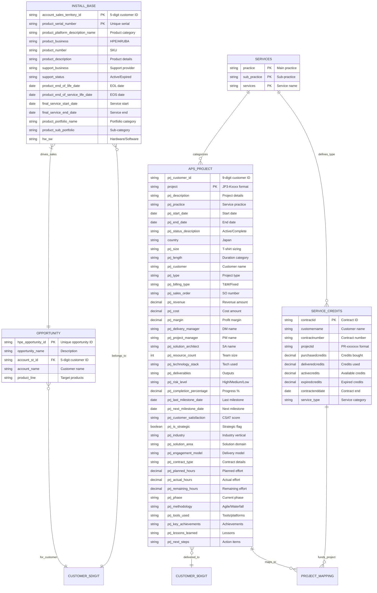
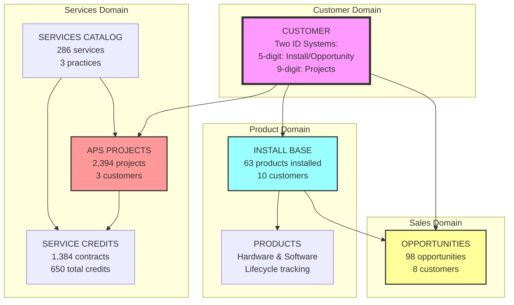
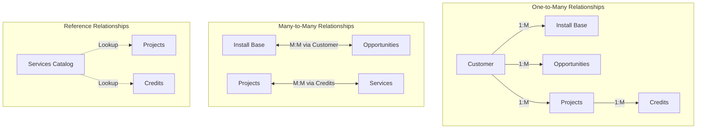
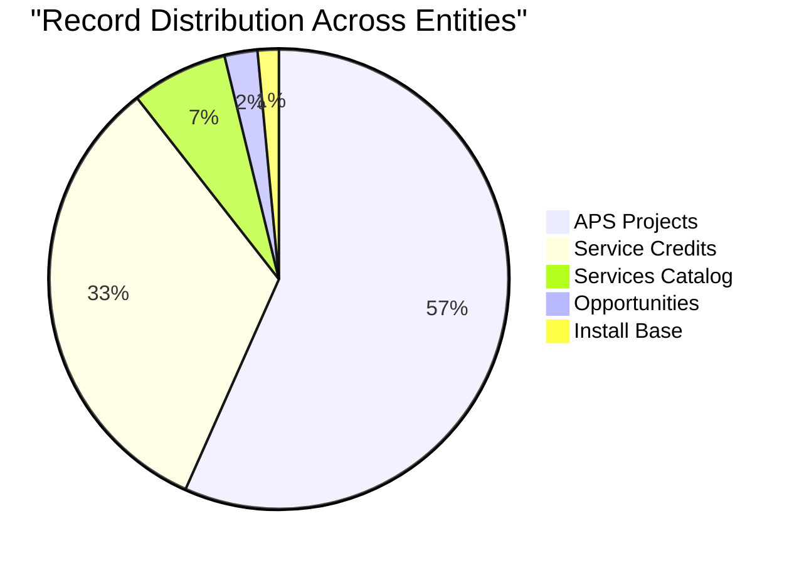

# 📊 Entity Relationship Diagram - DataExportAug29th.xlsx

## 🎯 Overview
This document presents the actual Entity Relationship Diagram based on the Excel file `DataExportAug29th.xlsx` with all its sheets and their relationships.

---

## 📐 Complete ER Diagram (Based on Excel Structure)

### Conceptual ER Diagram with All Attributes



---

## 🔗 Simplified Business View

### Core Business Entities and Their Relationships



---

## 📊 Entity Details from Excel

### 1. INSTALL_BASE Entity (Sheet: "Install Base")
**Purpose**: Track customer product installations  
**Records**: 63  
**Primary Key**: Composite (account_sales_territory_id + product_serial_number)

```
Key Attributes:
├── Customer Identifier: account_sales_territory_id (5-digit)
├── Product Identifier: product_serial_number
├── Product Details: platform, business, description
├── Support Status: status, coverage dates
└── Lifecycle Dates: EOL, EOS, service dates
```

### 2. OPPORTUNITY Entity (Sheet: "Opportunity")
**Purpose**: Sales pipeline tracking  
**Records**: 98  
**Primary Key**: hpe_opportunity_id

```
Key Attributes:
├── Opportunity ID: Unique identifier
├── Customer Link: account_st_id (matches Install Base)
├── Opportunity Details: name, product line
└── Account Information: customer name
```

### 3. APS_PROJECT Entity (Sheet: "A&PS Project sample")
**Purpose**: Professional services delivery  
**Records**: 2,394  
**Primary Key**: project (JP3-K format)

```
Key Attributes:
├── Project ID: JP3-Kxxxx format
├── Customer ID: 9-digit (different from Install Base)
├── Project Details: 44 attributes including financials
├── Timeline: start date, end date, milestones
└── Resources: team members, hours, deliverables
```

### 4. SERVICE_CREDITS Entity (Sheet: "Service Credits")
**Purpose**: Credit purchase and utilization  
**Records**: 1,384  
**Primary Key**: contractid

```
Key Attributes:
├── Contract ID: Unique identifier
├── Project Link: projectid (PR- format)
├── Credit Metrics: purchased, delivered, active, expired
└── Contract Details: number, end date
```

### 5. SERVICES Entity (Sheet: "Services")
**Purpose**: Service taxonomy reference  
**Records**: 286  
**Primary Key**: Composite (practice + sub_practice + services)

```
Key Attributes:
├── Practice: High-level category
├── Sub-Practice: Service area
└── Services: Specific service offerings
```

---

## 🔄 Relationship Analysis

### Direct Relationships (Working)


**Join Success Rate**: 80% (8 of 10 customers have opportunities)

### Indirect Relationships (Need Mapping)


---

## 🗂️ Data Model Classification

### Entity Types

| Entity | Type | Role | Cardinality |
|--------|------|------|-------------|
| **CUSTOMER** | Master | Parent entity (implied) | 1 |
| **INSTALL_BASE** | Transactional | Many-to-One with Customer | M |
| **OPPORTUNITY** | Transactional | Many-to-One with Customer | M |
| **APS_PROJECT** | Transactional | Many-to-One with Customer | M |
| **SERVICE_CREDITS** | Transactional | Many-to-One with Project | M |
| **SERVICES** | Reference | Lookup/Taxonomy | 1 |

### Relationship Matrix



---

## 💡 Key Insights from ER Analysis

### 1. Customer Identity Crisis
- **Two separate customer ID systems** preventing unified view
- 5-digit system: Used by Install Base and Opportunities
- 9-digit system: Used by APS Projects
- **Impact**: Cannot link services to product installations

### 2. Project Tracking Disconnect
- **Two project ID formats** preventing integration
- JP3-K format: Used by APS Projects
- PR- format: Used by Service Credits
- **Impact**: Cannot track credit utilization by project

### 3. Strong Core Relationship
- **Install Base ↔ Opportunity** link is solid
- 80% of customers with installations have opportunities
- Enables cross-sell/upsell analysis

### 4. Service Taxonomy Issues
- Services catalog uses different naming than projects
- Inconsistent practice categorization
- **Impact**: Difficult to aggregate services by type

---

## 🛠️ Recommended Data Model Improvements

### 1. Create Unified Customer Master

```sql
CREATE TABLE customer_master (
    customer_id INT PRIMARY KEY,
    customer_id_5digit VARCHAR(5) UNIQUE,
    customer_id_9digit VARCHAR(9) UNIQUE,
    customer_name VARCHAR(255),
    INDEX idx_5digit (customer_id_5digit),
    INDEX idx_9digit (customer_id_9digit)
);
```

### 2. Create Project Registry

```sql
CREATE TABLE project_registry (
    project_id INT PRIMARY KEY,
    project_id_aps VARCHAR(20) UNIQUE,  -- JP3-K format
    project_id_credit VARCHAR(20) UNIQUE, -- PR- format
    customer_id INT REFERENCES customer_master(customer_id),
    project_name VARCHAR(255),
    INDEX idx_aps (project_id_aps),
    INDEX idx_credit (project_id_credit)
);
```

### 3. Normalize Install Base

```sql
CREATE TABLE install_base_normalized (
    install_id INT PRIMARY KEY,
    customer_id INT REFERENCES customer_master(customer_id),
    product_id INT REFERENCES product_catalog(product_id),
    serial_number VARCHAR(100) UNIQUE,
    support_status VARCHAR(50),
    eol_date DATE,
    INDEX idx_customer (customer_id),
    INDEX idx_product (product_id),
    INDEX idx_eol (eol_date)
);
```

---

## 📈 Data Volume Summary



### Total Records by Entity
- **APS Projects**: 2,394 records (55% of total)
- **Service Credits**: 1,384 records (32% of total)
- **Services**: 286 records (7% of total)
- **Opportunities**: 98 records (2% of total)
- **Install Base**: 63 records (1% of total)
- **Total**: 4,225 records across all sheets

---

## 🚀 Implementation Path

### Phase 1: Quick Wins (1 week)
1. Create customer mapping table
2. Create project mapping table
3. Standardize service taxonomy

### Phase 2: Database Design (2 weeks)
1. Design normalized schema
2. Create indexes and constraints
3. Build views for reporting

### Phase 3: Migration (1 week)
1. ETL from Excel to database
2. Data validation
3. Application updates

---

## 📝 SQL DDL for Complete Schema

```sql
-- Complete database schema based on Excel structure
CREATE DATABASE hpe_onelead;
USE hpe_onelead;

-- Customer dimension (unified)
CREATE TABLE dim_customer (
    customer_key INT AUTO_INCREMENT PRIMARY KEY,
    customer_id_5digit VARCHAR(5),
    customer_id_9digit VARCHAR(9),
    customer_name VARCHAR(255),
    territory VARCHAR(100),
    region VARCHAR(50),
    country VARCHAR(100),
    UNIQUE KEY uk_5digit (customer_id_5digit),
    UNIQUE KEY uk_9digit (customer_id_9digit)
);

-- Product dimension
CREATE TABLE dim_product (
    product_key INT AUTO_INCREMENT PRIMARY KEY,
    product_serial_number VARCHAR(100) UNIQUE,
    product_number VARCHAR(50),
    product_description VARCHAR(500),
    product_platform VARCHAR(100),
    product_business VARCHAR(50),
    product_portfolio VARCHAR(100),
    hw_sw VARCHAR(20),
    eol_date DATE,
    eos_date DATE,
    INDEX idx_eol (eol_date)
);

-- Install base fact
CREATE TABLE fact_install_base (
    install_key INT AUTO_INCREMENT PRIMARY KEY,
    customer_key INT,
    product_key INT,
    support_status VARCHAR(50),
    support_business VARCHAR(100),
    service_start_date DATE,
    service_end_date DATE,
    days_to_eol INT GENERATED ALWAYS AS (DATEDIFF(eol_date, CURDATE())) STORED,
    days_to_eos INT GENERATED ALWAYS AS (DATEDIFF(eos_date, CURDATE())) STORED,
    FOREIGN KEY (customer_key) REFERENCES dim_customer(customer_key),
    FOREIGN KEY (product_key) REFERENCES dim_product(product_key),
    INDEX idx_customer (customer_key),
    INDEX idx_support (support_status)
);

-- Opportunity fact
CREATE TABLE fact_opportunity (
    opportunity_key INT AUTO_INCREMENT PRIMARY KEY,
    opportunity_id VARCHAR(50) UNIQUE,
    customer_key INT,
    opportunity_name VARCHAR(255),
    product_line VARCHAR(100),
    created_date DATE DEFAULT CURDATE(),
    FOREIGN KEY (customer_key) REFERENCES dim_customer(customer_key),
    INDEX idx_customer (customer_key)
);

-- Project fact
CREATE TABLE fact_project (
    project_key INT AUTO_INCREMENT PRIMARY KEY,
    project_id VARCHAR(20) UNIQUE,
    customer_key INT,
    project_description TEXT,
    practice VARCHAR(100),
    start_date DATE,
    end_date DATE,
    status VARCHAR(50),
    country VARCHAR(100),
    project_size VARCHAR(20),
    project_length VARCHAR(50),
    FOREIGN KEY (customer_key) REFERENCES dim_customer(customer_key),
    INDEX idx_customer (customer_key),
    INDEX idx_dates (start_date, end_date)
);

-- Service credits fact
CREATE TABLE fact_service_credit (
    credit_key INT AUTO_INCREMENT PRIMARY KEY,
    contract_id VARCHAR(50) UNIQUE,
    project_id VARCHAR(50),
    customer_name VARCHAR(255),
    contract_number VARCHAR(50),
    purchased_credits DECIMAL(10,2),
    delivered_credits DECIMAL(10,2),
    active_credits DECIMAL(10,2),
    expired_credits DECIMAL(10,2),
    utilization_rate DECIMAL(5,2) GENERATED ALWAYS AS 
        ((delivered_credits / NULLIF(purchased_credits, 0)) * 100) STORED,
    contract_end_date DATE,
    INDEX idx_project (project_id),
    INDEX idx_utilization (utilization_rate)
);

-- Services reference
CREATE TABLE ref_services (
    service_key INT AUTO_INCREMENT PRIMARY KEY,
    practice VARCHAR(100),
    sub_practice VARCHAR(100),
    service_name VARCHAR(255),
    UNIQUE KEY uk_service (practice, sub_practice, service_name)
);

-- Create views for analysis
CREATE VIEW v_customer_360 AS
SELECT 
    c.customer_name,
    c.customer_id_5digit,
    COUNT(DISTINCT ib.install_key) as installed_products,
    COUNT(DISTINCT o.opportunity_key) as opportunities,
    COUNT(DISTINCT p.project_key) as projects,
    SUM(sc.purchased_credits) as total_credits_purchased,
    AVG(sc.utilization_rate) as avg_credit_utilization
FROM dim_customer c
LEFT JOIN fact_install_base ib ON c.customer_key = ib.customer_key
LEFT JOIN fact_opportunity o ON c.customer_key = o.customer_key
LEFT JOIN fact_project p ON c.customer_key = p.customer_key
LEFT JOIN fact_service_credit sc ON sc.customer_name = c.customer_name
GROUP BY c.customer_key, c.customer_name, c.customer_id_5digit;
```

---

*Generated: September 2024*  
*Source: DataExportAug29th.xlsx*  
*Purpose: Complete ER diagram and data model documentation*