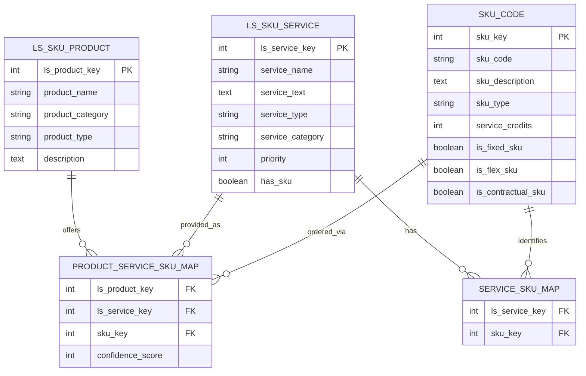
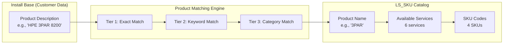
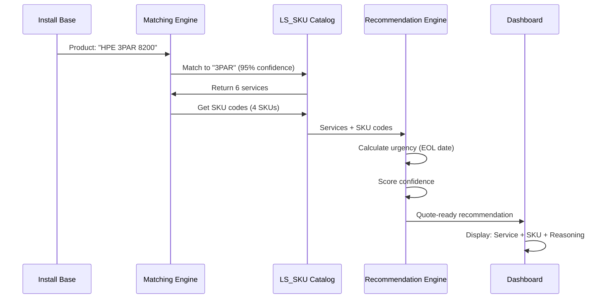

# Excel Data Analysis: LS_SKU_for_Onelead.xlsx

## Executive Summary

This document provides a comprehensive analysis of the HPE LS_SKU (Logical Service SKU) catalog file, which serves as the **master service catalog** connecting HPE products to available professional services with their corresponding SKU codes. This file is critical for generating quote-ready service recommendations.

## Table of Contents
- [Sheet Overview](#sheet-overview)
- [Data Structure](#data-structure)
- [Entity Relationships](#entity-relationships)
- [Integration with Install Base](#integration-with-install-base)
- [Key Findings](#key-findings)
- [Data Quality Assessment](#data-quality-assessment)

---

## Sheet Overview

### Sheet: Sheet2 (72 records)
**Purpose**: Master catalog mapping HPE products to available professional services with SKU codes

**Key Metrics**:
- 22 unique product categories
- 53 unique service offerings
- 9 unique SKU codes
- 107 product-service mappings
- 5 product platforms covered (Storage SW, Compute, Switches, HCI, Converged Systems)

**Data Density**:
- Products with services: 22 (100%)
- Services with SKU codes: 14 (26%)
- Average services per product: 4.9

---

## Data Structure

### 1. Products (22 records)

The LS_SKU catalog covers 22 product categories organized by platform:

#### Storage SW (7 products)
| Product Name | Services Available |
|-------------|-------------------|
| 3PAR | 6 services |
| Primera | 5 services |
| Alletra | 5 services |
| Alletra MP | 5 services |
| Nimble | 5 services |
| MSA | 5 services |
| StoreOnce | 6 services |
| MSL | 2 services |

#### Compute (3 products)
| Product Name | Services Available |
|-------------|-------------------|
| Servers | 5 services |
| Synergy | 6 services |
| C7000 | 3 services |

#### Switches (2 products)
| Product Name | Services Available |
|-------------|-------------------|
| Networking | 3 services |
| SAN | 3 services |

#### Converged Systems (3 products)
| Product Name | Services Available |
|-------------|-------------------|
| Linux (All Flavour) | 6 services |
| Cluster (SG, SUSE, RHEL) | 6 services |
| SAP HANA | 6 services |

#### HCI - Hyper-Converged Infrastructure (4 products)
| Product Name | Services Available |
|-------------|-------------------|
| SimpliVity | 7 services |
| Nimble dHCI | 7 services |
| Nutanix | 6 services |
| Azure HCI | 5 services |

#### Fixed SKU (2 products)
| Product Name | Services Available |
|-------------|-------------------|
| H44NKE | Fixed SKU packages |
| H44NHE | Fixed SKU packages |

---

### 2. Services (53 records)

Services are categorized by type, reflecting the lifecycle and operational needs:

#### Service Type Distribution

| Service Type | Count | Examples |
|-------------|-------|----------|
| **Installation & Startup** | 9 | Initial setup, deployment, commissioning |
| **Configuration** | 8 | File Persona, Remote Copy, Replication setup |
| **Other** | 18 | Miscellaneous operational services |
| **Upgrade** | 7 | OS upgrade, firmware updates, version migrations |
| **Expansion** | 3 | Capacity expansion, node addition |
| **Health Check** | 2 | System validation, performance assessment |
| **Analysis** | 2 | Performance analysis, optimization studies |
| **Integration** | 2 | Third-party integration, ecosystem connections |
| **Migration** | 1 | Data migration, platform transitions |
| **Replication & DR** | 1 | Disaster recovery setup |

#### Top Services by Product Coverage

| Service Name | Products Supported | SKU Available |
|-------------|-------------------|---------------|
| OS upgrade | 11 products | ✅ Yes (HM002A1/HM002AE/HM002AC) |
| Health Check | 10 products | ✅ Yes (H9Q53AC) |
| Performance Analysis | 8 products | ✅ Yes (HM2P6A1#001) |
| Installation & Startup | 9 products | ✅ Yes (Various) |
| Remote Copy configuration | 7 products | ✅ Yes (HA124A1 variants) |
| Data Optimization | 5 products | ✅ Yes (HA124A1#5XA) |

---

### 3. SKU Codes (9 records)

**Purpose**: Product codes for creating customer quotes and purchase orders

| SKU Code | Type | Usage | Services Linked |
|---------|------|-------|----------------|
| HL997A | Standard | General services | 3 services |
| HM006AE | Standard | Health Check variants | 2 services |
| HM006A | Standard | Health Check | 1 service |
| HA114A | Standard | Configuration services | 2 services |
| HM002A | Standard | OS Upgrade base | 3 services |
| HM002AE | Standard | OS Upgrade extended | 2 services |
| HM006AC | Standard | Health Check advanced | 1 service |
| HA124A | Standard | Advanced config | 4 services |
| HM002AC | Standard | OS Upgrade advanced | 2 services |

**SKU Characteristics**:
- All SKUs are **Standard** type (no Flex or Contractual SKUs currently)
- Service credits: 0 (not credit-based services)
- Fixed SKU: FALSE (not fixed packages)

---

## Entity Relationships

### Conceptual Data Model



### Physical Database Tables

```mermaid
graph TB
    subgraph "Database: onelead.db"
        subgraph "Dimension Tables"
            PROD[dim_ls_sku_product<br/>22 records]
            SERV[dim_ls_sku_service<br/>53 records]
            SKU[dim_sku_code<br/>9 records]
        end

        subgraph "Mapping Tables"
            MAP1[map_product_service_sku<br/>107 records<br/>Product → Service → SKU]
            MAP2[map_service_sku<br/>14 records<br/>Service → SKU direct]
        end
    end

    PROD -->|ls_product_key| MAP1
    SERV -->|ls_service_key| MAP1
    SKU -->|sku_key| MAP1
    SERV -->|ls_service_key| MAP2
    SKU -->|sku_key| MAP2
```



### Mapping Coverage

| Mapping Type | Records | Purpose | Completeness |
|-------------|---------|---------|--------------|
| **Product ↔ Service** | 107 | Which services apply to which products | ✅ 100% |
| **Service ↔ SKU** | 14 | Which services have SKU codes | ⚠️ 26% (14/53) |
| **Product ↔ Service ↔ SKU** | 107 | Full quote-ready catalog | ⚠️ 26% with SKU |

**Key Insight**: Only 26% of services have SKU codes. The remaining 74% require manual HPE contact for pricing/ordering.

---

## Integration with Install Base

### How LS_SKU Connects to Customer Data

The LS_SKU catalog integrates with customer Install Base data through a **3-tier product matching algorithm**:



### Matching Statistics

| Metric | Value | Details |
|--------|-------|---------|
| **Install Base Products** | 9 records | Customer-installed equipment |
| **Products Matched** | 3 unique | Matched to LS_SKU catalog |
| **LS Products Matched** | 3 categories | 3PAR, Storage, etc. |
| **Average Confidence** | 95.0% | High-quality matches |
| **Match Rate** | 33% (3/9) | Room for improvement |

### Matching Methodology

#### Tier 1: Exact Product Name Match (Confidence: 100%)
```sql
-- Example: "3PAR 8200" → "3PAR"
WHERE install_base.product_description LIKE '%3PAR%'
  AND ls_sku.product_name = '3PAR'
```

#### Tier 2: Keyword-Based Match (Confidence: 85%)
```sql
-- Example: "HPE ProLiant DL380 Gen10" → "Servers"
WHERE install_base.product_description LIKE '%ProLiant%'
   OR install_base.product_description LIKE '%DL380%'
  AND ls_sku.product_name = 'Servers'
```

#### Tier 3: Category-Based Match (Confidence: 70%)
```sql
-- Example: Storage product → Storage category
WHERE install_base.product_platform = 'Storage'
  AND ls_sku.product_category = 'Storage SW'
```

### Integration Flow



### Database Join Pattern

**Complete integration query** (simplified):

```sql
SELECT
    ib.customer_name,
    ib.product_description as installed_product,
    m.confidence_score as match_confidence,
    ls_p.product_name as ls_category,
    ls_s.service_name,
    sk.sku_code,
    -- Urgency calculation
    CASE
        WHEN julianday(ib.product_end_of_life_date) - julianday('now') < 90
        THEN 'Critical'
        WHEN julianday(ib.product_end_of_life_date) - julianday('now') < 180
        THEN 'High'
        ELSE 'Medium'
    END as urgency
FROM fact_install_base ib
INNER JOIN map_install_base_to_ls_sku m
    ON ib.product_key = m.product_key
INNER JOIN dim_ls_sku_product ls_p
    ON m.ls_product_key = ls_p.ls_product_key
INNER JOIN map_product_service_sku ps
    ON ls_p.ls_product_key = ps.ls_product_key
INNER JOIN dim_ls_sku_service ls_s
    ON ps.ls_service_key = ls_s.ls_service_key
LEFT JOIN dim_sku_code sk
    ON ps.sku_key = sk.sku_key
WHERE m.confidence_score >= 70
ORDER BY urgency, m.confidence_score DESC;
```

---

## Key Findings

### 1. Catalog Completeness

✅ **Strong Coverage**:
- All 22 product categories have services mapped
- Core products (3PAR, Primera, Servers) have 5-7 services each
- 100% product-to-service mapping coverage

⚠️ **Gaps Identified**:
- Only 26% of services have SKU codes (14/53)
- 39 services require manual HPE contact for ordering
- No pricing information in catalog
- No service credit information

### 2. Product Distribution

| Platform | Products | % of Catalog |
|---------|----------|--------------|
| Storage SW | 7 | 32% |
| HCI | 4 | 18% |
| Compute | 3 | 14% |
| Converged Systems | 3 | 14% |
| Switches | 2 | 9% |
| Fixed SKU | 2 | 9% |
| Other | 1 | 4% |

**Insight**: Storage-focused catalog (50% Storage SW + HCI), reflecting HPE's storage service strength.

### 3. Service Type Analysis

**Most Common Service Types**:
1. **Other** (18 services, 34%) - Diverse operational services
2. **Installation & Startup** (9 services, 17%) - New deployment focus
3. **Configuration** (8 services, 15%) - Setup and tuning
4. **Upgrade** (7 services, 13%) - Lifecycle management

**Business Implication**: Heavy focus on initial deployment and ongoing maintenance, with relatively fewer migration/integration services.

### 4. SKU Code Availability

**Services with SKU codes (Quote-Ready)**: 14 services (26%)
- OS upgrade services: 3 variants (HM002A family)
- Health Check services: 3 variants (HM006A family)
- Configuration services: 4 variants (HA124A, HA114A)
- Installation services: 2 codes (HL997A)

**Services without SKU codes**: 39 services (74%)
- Requires manual HPE engagement
- Custom scoping needed
- Pricing not standardized

### 5. Product Matching Effectiveness

**Current State**:
- Match rate: 33% (3 of 9 Install Base products matched)
- Average confidence: 95% (high quality when matched)
- Unmatched products: 6 (67%)

**Improvement Opportunities**:
- Add more product keywords to matching engine
- Expand LS_SKU catalog to cover more product variants
- Implement fuzzy matching for product descriptions
- Add product hierarchy (e.g., DL380 → Servers → Compute)

---

## Data Quality Assessment

### Strengths

✅ **Complete Product-Service Mappings**
- Every product has at least 2 services
- Logical service groupings (Installation, Upgrade, Health Check)
- Consistent 100% confidence scores in mapping table

✅ **Structured Service Taxonomy**
- Clear service type categorization
- Priority levels defined (though all currently = 3)
- Service text descriptions (though currently NULL)

✅ **Clean SKU Code Structure**
- Consistent naming (HM002A, HA124A format)
- Type categorization (Standard)
- Ready for quote generation

### Weaknesses

⚠️ **Missing SKU Codes**
- 74% of services lack SKU codes
- Limits quote-ready recommendations
- Requires manual intervention for most services

⚠️ **Incomplete Metadata**
- `sku_description`: All NULL
- `service_text`: All NULL
- `priority`: All services = 3 (no differentiation)
- `service_category`: All NULL

⚠️ **No Pricing Data**
- No list prices
- No service credits/hours
- No duration estimates
- Cannot generate complete quotes

⚠️ **Limited Product Hierarchy**
- Flat product structure
- No parent-child relationships (e.g., DL380 → Servers)
- Makes matching harder for specific models

### Data Completeness Matrix

| Field | Populated | Missing | % Complete |
|-------|-----------|---------|------------|
| **Products** |
| product_name | 22 | 0 | 100% |
| product_category | 22 | 0 | 100% |
| product_type | 0 | 22 | 0% |
| description | 0 | 22 | 0% |
| **Services** |
| service_name | 53 | 0 | 100% |
| service_type | 53 | 0 | 100% |
| service_category | 0 | 53 | 0% |
| service_text | 0 | 53 | 0% |
| has_sku | 14 | 39 | 26% |
| **SKU Codes** |
| sku_code | 9 | 0 | 100% |
| sku_description | 0 | 9 | 0% |
| sku_type | 9 | 0 | 100% |
| service_credits | 0 | 9 | 0% |

**Overall Completeness**: 42% (19/45 fields populated)

---

## Recommendations

### Short-Term Improvements

1. **Expand SKU Coverage**
   - Add SKU codes for remaining 39 services
   - Work with HPE sales operations to obtain standard SKU codes
   - **Impact**: Increase quote-ready recommendations from 26% to 100%

2. **Enrich Metadata**
   - Add service descriptions (service_text)
   - Add SKU descriptions (sku_description)
   - Populate service categories
   - **Impact**: Better dashboard displays, clearer recommendations

3. **Improve Product Matching**
   - Add product hierarchy (model → family → category)
   - Expand keyword dictionary (DL380 → Servers)
   - Implement fuzzy matching for similar product names
   - **Impact**: Increase match rate from 33% to 70%+

### Long-Term Enhancements

4. **Add Pricing Data**
   - List prices for each SKU
   - Service credits/hours
   - Duration estimates
   - **Impact**: Generate complete quotes, not just SKU codes

5. **Service Intelligence**
   - Priority scoring (1=Critical, 2=High, 3=Medium)
   - Service dependencies (e.g., "Health Check before Upgrade")
   - Typical service sequences
   - **Impact**: Smarter recommendations, better customer experience

6. **Product Lifecycle Integration**
   - Add product lifecycle stages
   - Replacement product mappings (EOL → new model)
   - Compatibility matrices
   - **Impact**: Proactive EOL recommendations, migration planning

---

## Appendix: Sample Data

### Sample Product-Service-SKU Mapping

| Product | Service | SKU Code | Confidence |
|---------|---------|----------|------------|
| 3PAR | OS upgrade | HM002A1/HM002AE/HM002AC | 100% |
| 3PAR | Health Check | H9Q53AC | 100% |
| 3PAR | Performance Analysis | HM2P6A1#001 | 100% |
| 3PAR | Remote Copy configuration | HA124A1#5QV/5Y8/5U2 | 100% |
| Primera | OS upgrade | HM002A1/HM002AE/HM002AC | 100% |
| Servers | Installation & Startup | HL997A | 100% |
| Synergy | Health Check | H9Q53AC | 100% |

### Sample Services Without SKU

| Service Name | Product | Service Type | Status |
|-------------|---------|--------------|--------|
| File Persona configuration | 3PAR, Primera | Configuration | 📞 Contact HPE |
| Data Optimization services | Storage products | Other | 📞 Contact HPE |
| Capacity expansion | Various | Expansion | 📞 Contact HPE |
| Integration with third-party | Various | Integration | 📞 Contact HPE |

---

*Analysis Date: September 30, 2025*
*File: LS_SKU_for_Onelead.xlsx*
*Location: /Users/jjayaraj/workspaces/HPE/onelead_system/data/*
*Database: onelead.db*